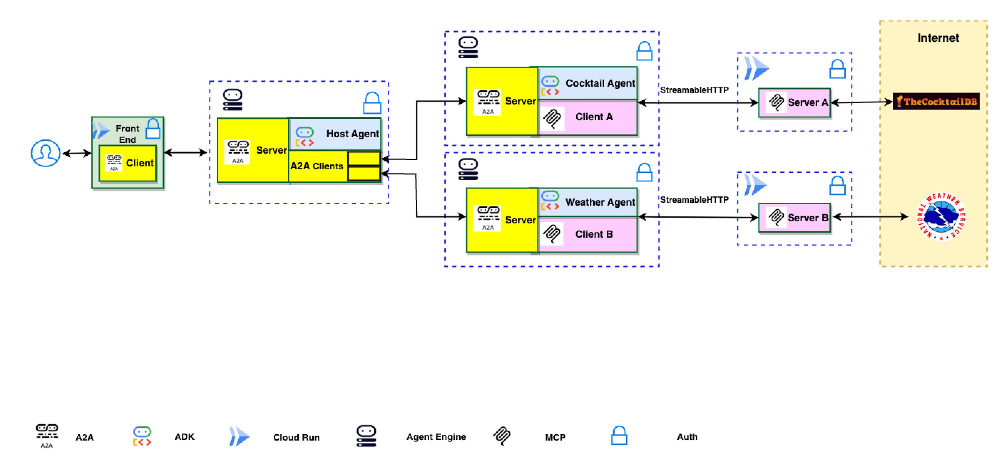
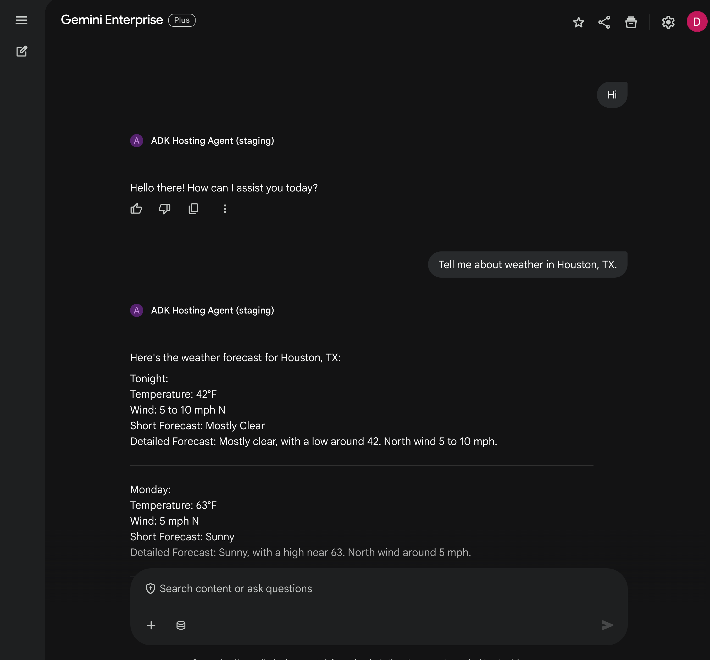

# A2A Multi-Agent on Agent Engine with CI/CD

> **DISCLAIMER**: This demo is intended for demonstration purposes only. It is not intended for use in a production environment.
>
> **Important**: A2A is a work in progress (WIP) thus, in the near future there might be changes that are different from what demonstrated here.

## Overview

This project provides an automated CI/CD pipeline for deploying an Agent-to-Agent (A2A) multi-agent system on Google Cloud with Gemini Enterprise (GE) Agentspace integration.

It demonstrates the integration of Google's open source frameworks Agent2Agent (A2A) and Agent Development Kit (ADK) for multi-agent orchestration with Model Context Protocol (MCP) clients. A host agent coordinates tasks between specialized remote A2A agents that interact with various MCP servers to fulfill user requests.

Instead of running manual deployment notebook cells, this solution is fully automated via Cloud Build using Python applications.

### Architecture

The application utilizes a multi-agent architecture where a host agent delegates tasks to remote A2A agents (Cocktail and Weather) based on the user's query. These agents then interact with corresponding remote MCP servers.



### Application Screenshot



## Core Components

### Agents

The application employs three distinct agents, deployed to Vertex AI Agent Engine:

- **Host Agent:** The main entry point that receives user queries, determines the required task(s), and delegates to the appropriate specialized agent(s).
- **Cocktail Agent:** Handles requests related to cocktail recipes and ingredients by interacting with the Cocktail MCP server.
- **Weather Agent:** Manages requests related to weather forecasts by interacting with the Weather MCP server.

### MCP Servers

The agents interact with the following MCP servers, deployed to Cloud Run:

1. **Cocktail MCP Server** - Provides 5 tools:
   - `search cocktail by name`
   - `list all cocktail by first letter`
   - `search ingredient by name`
   - `list random cocktails`
   - `lookup full cocktail details by id`

2. **Weather MCP Server** - Provides 3 tools:
   - `get weather forecast by city name`
   - `get weather forecast by coordinates`
   - `get weather alert by state code`

### Frontend

A Gradio-based web interface for interacting with the Hosting Agent.

## CI/CD Pipeline

Google Cloud Build triggers from your git actions. Refer to `.cloudbuild/staging.yaml` and `.cloudbuild/deploy-to-prod.yaml` for complete environment configuration.

1. **Build & Deploy MCP Servers:** Deploys FastMCP endpoints on Cloud Run.
2. **Deploy A2A Agents:** Runs `deployment/deploy_agents.py` to deploy Cocktail, Weather, and Hosting agents into Agent Engine using the `A2aAgent` wrapper.
3. **Deploy Frontend:** Hosts the web portal connected to the Hosting Agent.
4. **Register to Gemini Enterprise:** Automatically links the Hosting Agent Engine configuration directly into your Agentspace App.

> **Optimization Note:** The pipeline checks the `COMMIT_SHA` of the currently deployed services and agents. If the deployed version matches the current commit, the deployment step is skipped to reduce build time.

## Project Structure

```
.
├── .cloudbuild/
│   ├── staging.yaml              # Staging deployment pipeline
│   ├── deploy-to-prod.yaml       # Production deployment pipeline
│   └── pr_checks.yaml            # Pull request validation
├── src/
│   ├── a2a_agents/               # Agent implementations
│   │   ├── cocktail_agent/       # Cocktail query agent
│   │   ├── weather_agent/        # Weather query agent
│   │   ├── hosting_agent/        # Orchestrator agent
│   │   └── common/               # Shared base classes and utilities
│   ├── mcp_servers/              # MCP tool servers
│   │   ├── cocktail_mcp_server/  # Cocktail database tools
│   │   └── weather_mcp_server/   # Weather forecast tools
│   └── frontend/                 # Gradio web UI
├── deployment/
│   ├── deploy_agents.py          # Single script to deploy all agents
│   └── terraform/                # Infrastructure as Code
├── scripts/
│   ├── deploy_agent.py           # Generic agent deployment CLI
│   └── register_agent_to_agentspace.py
├── tests/
│   ├── unit/
│   └── integration/
└── pyproject.toml
```

## Setup and Deployment

### Prerequisites

1. [Python 3.13+](https://www.python.org/downloads/)
2. [gcloud SDK](https://cloud.google.com/sdk/docs/install)
3. [uv](https://docs.astral.sh/uv/getting-started/installation/) - Python package manager
4. [Terraform](https://developer.hashicorp.com/terraform/install) - Infrastructure provisioning

### Infrastructure Setup

1. Configure `deployment/terraform/vars/env.tfvars` with your project IDs, region, and GitHub repository details.
2. Apply Terraform to provision GCP resources:
   ```bash
   cd deployment/terraform
   terraform init
   terraform apply -var-file=vars/env.tfvars
   ```

### CI/CD Setup

1. Link your git repository to **Google Cloud Build** (handled by Terraform).
2. Configure the following substitution variables in the Cloud Build YAML files or via Terraform:
   - `_REGION`: GCP region (default: `us-central1`)
   - `_PROJECT_NUMBER`: Your Google Cloud Project Number
   - `_AS_APP`: Agentspace App ID
   - `_AUTH_ID`: OAuth client ID for Gemini Enterprise
3. Push to the `staging` branch to trigger the staging pipeline.

### Local Development

```bash
# Install dependencies
uv sync

# Run unit tests
uv run pytest tests/unit

# Run integration tests
uv run pytest tests/integration
```

## Example Usage

Here are some example questions you can ask the chatbot:

- `Please get cocktail margarita id and then full detail of cocktail margarita`
- `Please list a random cocktail`
- `Please get weather forecast for New York`
- `Please get weather forecast for 40.7128,-74.0060`

## Disclaimer

The sample code provided is for demonstration purposes and illustrates the mechanics of the Agent-to-Agent (A2A) protocol. When building production applications, it is critical to treat any agent operating outside of your direct control as a potentially untrusted entity.

All data received from an external agent—including but not limited to its AgentCard, messages, artifacts, and task statuses—should be handled as untrusted input. Developers are responsible for implementing appropriate security measures, such as input validation and secure handling of credentials to protect their systems and users.

## License

This project is licensed under the [Apache License 2.0](LICENSE).
