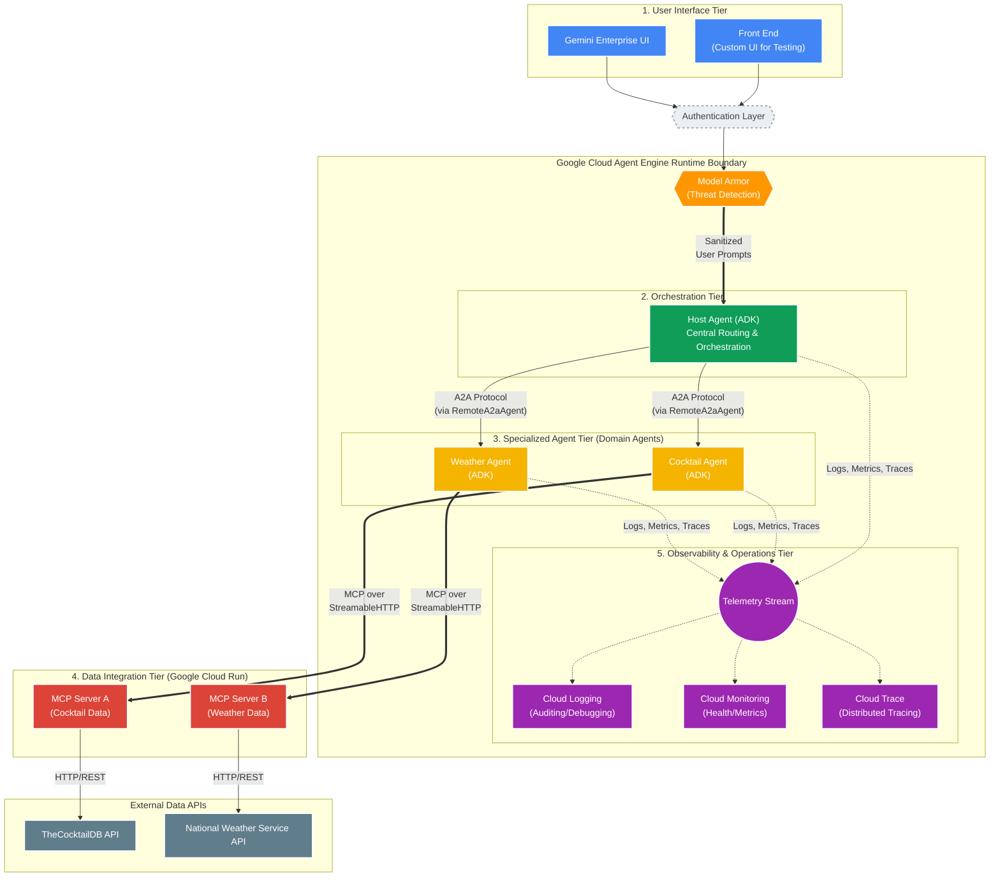

# Gemini Enterprise with A2A Multi-Agent on Agent Engine

This project demonstrates a multi-agent system using Agent2Agent (A2A), Agent Development Kit (ADK), Agent Engine, and Model Context Protocol (MCP) servers. A host agent orchestrates specialized remote agents (Cocktail and Weather) that interact with MCP servers on Cloud Run. The system deploys to Google Cloud via a CI/CD pipeline powered by Cloud Build.

## Table of Contents

| Section | What You'll Find |
|---------|-----------------|
| [Overview](#overview) | Architecture, components, and how the system works |
| [Project Structure](#project-structure) | Directory layout and key files |
| [Quick Start](#quick-start) | Prerequisites to get started |
| [Local Development](#local-development--testing-setup) | **Start here** — env setup, local testing, and running tests |
| [CI/CD Setup](#cicd-setup-with-google-cloud-build-v2) | Set up the deployment pipeline (GCP projects, Terraform, Cloud Build) |
| [CI/CD Pipeline Details](#cicd-pipeline-details) | How the pipelines work, environment variable flow, and per-pipeline breakdown |
| [Deployment](#deployment) | Deploy to staging and production, secure the frontend |
| [Troubleshooting](#troubleshooting) | Common issues and debugging tips |

## Overview

This application demonstrates the integration of Google's Open Source frameworks Agent2Agent (A2A) and Agent Development Kit (ADK) for multi-agent orchestration with Model Context Protocol (MCP) clients. The application features a host agent coordinating tasks between specialized remote A2A agents that interact with various MCP servers to fulfill user requests.

### Architecture


The application utilizes a multi-agent architecture where a host agent delegates tasks to remote A2A agents (Cocktail and Weather) based on the user's query. These agents then interact with corresponding remote MCP servers.

**Host Agent is built using Agent Engine server and ADK agents.**
This architecture follows a highly modular, delegated multi-agent pattern, utilizing Agent2Agent (A2A) protocols and Model Context Protocol (MCP) for routing and data retrieval, backed by comprehensive Google Cloud observability tools within the Agent Engine runtime.

1. **User Interface (Frontend) Tier** — Users interact through two authenticated entry points:
   - Front End (Custom UI for testing purposes)
   - Gemini Enterprise UI

2. **Orchestration Tier (Host Agent)** — The central routing hub hosted within Google Cloud Agent Engine. Built using ADK, it receives authenticated user prompts, determines if requests pertain to cocktails or weather, and delegates via `RemoteA2aAgent` sub-agents using the A2A Protocol.

3. **Specialized Agent Tier (Domain Agents)** — Two independent, domain-specific agents hosted alongside the Host Agent within Agent Engine:
   - **Cocktail Agent (ADK):** Receives cocktail-related instructions via A2A and uses an MCP Client to fetch data over StreamableHTTP.
   - **Weather Agent (ADK):** Receives weather-related instructions via A2A and uses an MCP Client to fetch data over StreamableHTTP.

4. **Data Integration Tier (MCP Servers)** — Hosted on serverless Cloud Run:
   - **MCP Server A (Cocktail Data):** Queries TheCocktailDB API via HTTP/REST.
   - **MCP Server B (Weather Data):** Queries the National Weather Service API via HTTP/REST.

5. **Observability & Operations Tier** — Integrated within the Agent Engine boundary:
   - **Cloud Logging:** Detailed logs for debugging, auditing, and analysis.
   - **Cloud Monitoring:** Performance metrics, health monitoring, and alerting.
   - **Cloud Trace:** Distributed tracing across the multi-hop architecture.

6. **Security, Resilience & Secret Management Tier**
   - **Secret Manager:** Stores OAuth credentials securely.
   - **Model Armor:** Blocks prompt injection and data exfiltration threats.
   - **Circuit Breaker (`aiobreaker`):** Prevents cascading failures when external services are unavailable.

**Key Technologies:** Agent Engine, Cloud Run, ADK, A2A, MCP, StreamableHTTP, Cloud Trace, Cloud Monitoring, Cloud Logging, Secret Manager, Model Armor, `aiobreaker`, Vertex AI Session Service.

Here is the mermaid diagram of the workflow:



### Application Screenshot


## Core Components

### Agents

The application employs three distinct agents:

- **Host Agent:** An ADK `LlmAgent` that receives user queries, determines the required task(s), and delegates to the appropriate specialized agent(s) via `RemoteA2aAgent` sub-agents.
- **Cocktail Agent:** Handles requests related to cocktail recipes and ingredients by interacting with the Cocktail MCP server.
- **Weather Agent:** Manages requests related to weather forecasts by interacting with the Weather MCP server.

### MCP Servers and Tools

The agents interact with the following MCP servers:

1. **Cocktail MCP Server** (Cloud Run)
    - Provides 5 tools:
        - `search cocktail by name`
        - `list all cocktail by first letter`
        - `search ingredient by name`
        - `list random cocktails`
        - `lookup full cocktail details by id`
2. **Weather MCP Server** (Cloud Run)
    - Provides 3 tools:
        - `get weather forecast by city name`
        - `get weather forecast by coordinates`
        - `get weather alert by state code`

## Project Structure

```
.
├── .cloudbuild/                  # Cloud Build CI/CD pipelines
│   ├── pr_checks.yaml            #   PR validation (unit tests)
│   ├── staging.yaml              #   Staging deployment (on push to staging)
│   └── deploy-to-prod.yaml       #   Production deployment (manual approval)
├── assets/                       # Architecture diagrams, screenshots
├── deployment/
│   ├── deploy_agents.py          # Python script to deploy all agents
│   └── terraform/                # Terraform IaC for infrastructure
│       ├── apis.tf               #   GCP API enablement
│       ├── backend.tf            #   Terraform state backend (GCS)
│       ├── build_triggers.tf     #   Cloud Build triggers
│       ├── frontend.tf           #   Frontend Cloud Run service
│       ├── gemini_enterprise.tf  #   Registers Agent Engine to Gemini Enterprise
│       ├── github.tf             #   GitHub connection + repository
│       ├── iam.tf                #   IAM role assignments
│       ├── locals.tf             #   Agent definitions, service lists
│       ├── model_armor.tf        #   Model Armor configuration
│       ├── providers.tf          #   Provider versions
│       ├── service_accounts.tf   #   Service accounts (CICD + app)
│       ├── storage.tf            #   GCS buckets for logs
│       ├── telemetry.tf          #   BigQuery telemetry
│       ├── variables.tf          #   Input variables
│       ├── modules/              #   Reusable Terraform modules
│       │   ├── gemini_enterprise_oauth/
│       │   └── gemini_enterprise_agent_engine_register/
│       └── shells/               #   GE registration + MCP services
│           ├── gemini_enterprise_registration.tf
│           ├── mcp_servers.tf    #   MCP Cloud Run service definitions
│           └── mcp_iam.tf        #   MCP server IAM permissions
├── src/
│   ├── a2a_agents/               # Agent source code (workspace package)
│   │   ├── common/               #   Shared executors, auth utilities
│   │   ├── cocktail_agent/       #   Cocktail agent card, executor, ADK agent
│   │   ├── hosting_agent/        #   Host agent (LlmAgent + RemoteA2aAgent)
│   │   └── weather_agent/        #   Weather agent card, executor, ADK agent
│   ├── frontend/                 # Gradio frontend (connects via A2A)
│   │   ├── Dockerfile
│   │   ├── main.py
│   │   └── pyproject.toml
│   └── mcp_servers/              # MCP server implementations
│       ├── cocktail_mcp_server/
│       └── weather_mcp_server/
├── tests/
│   ├── test_config.py            # Shared test configuration
│   ├── test_utils.py             # Shared test utilities
│   ├── conftest.py               # Adds src/ to sys.path
│   ├── unit/                     # Unit tests (agent cards, servers, orchestrator logic)
│   ├── integration/              # Integration tests (local + remote agents, MCP servers)
│   ├── eval/                     # Evaluation suite (evalsets, LLM scoring)
│   └── load_test/                # Locust load tests
├── docs/                         # Documentation
│   ├── design.md                 #   Software Design Document
│   └── cicd_strategy.md          #   CI/CD pipeline architecture
├── .env.example                  # Environment variable template
├── pyproject.toml
├── uv.lock
├── Makefile
└── README.md
```

## Example Usage

Here are some example questions you can ask the chatbot:

- `Please get cocktail margarita id and then full detail of cocktail margarita`
- `Please list a random cocktail`
- `Please get weather forecast for New York`
- `What is the weather in Houston, TX?`

---

## Quick Start

### Prerequisites

1. [Python 3.13+](https://www.python.org/downloads/)
2. [gcloud SDK](https://cloud.google.com/sdk/docs/install)
3. [Terraform](https://developer.hashicorp.com/terraform/install) (>= 1.0)
4. [uv](https://docs.astral.sh/uv/getting-started/installation/) (Python package manager)
5. [Docker](https://docs.docker.com/get-docker/) (for local testing and deployment)
6. A GitHub repository for your source code
7. Three Google Cloud projects (see [GCP Project Layout](#gcp-project-layout))
8. **Gemini Enterprise App**: Set up a Gemini Enterprise App and note its App ID.
9. **OAuth Credentials**: Obtain OAuth credentials for Gemini Enterprise (Client ID and Client Secret) and store them in the Staging and Production projects' Secret Manager.

---

## Local Development & Testing Setup

### Understanding Environment Variables

This project uses environment variables in multiple locations:

1. **Local Testing**: `src/a2a_agents/.env` and `src/frontend/.env`
2. **Deployment**: `.env.deploy` (for manual deployments)
3. **CI/CD**: Terraform variables → Cloud Build substitutions
4. **Tests**: `tests/test_config.py` (loads from `.env.deploy`)

### Step 1: Get Your GCP Information

Before configuring, gather this information:

```bash
# Get your project IDs
gcloud projects list

# Get project numbers (needed for agents)
gcloud projects describe YOUR_STAGING_PROJECT_ID --format="value(projectNumber)"
gcloud projects describe YOUR_PROD_PROJECT_ID --format="value(projectNumber)"

# Note your region (typically us-central1)
REGION="us-central1"
```

### Step 2: Configure Local Environment Variables

#### Option A: Copy Example Files

```bash
# Copy environment templates
cp .env.example .env.deploy
cp src/a2a_agents/.env.example src/a2a_agents/.env
cp src/frontend/.env.example src/frontend/.env
```

#### Option B: Create from Scratch

**Create `.env.deploy`:**

```bash
# Deployment environment variables
PROJECT_ID=your-staging-project-id
GOOGLE_CLOUD_REGION=us-central1
APP_SERVICE_ACCOUNT=a2a-multiagent-ge-cicd-app@your-staging-project-id.iam.gserviceaccount.com
DISPLAY_NAME_SUFFIX=Staging
BUCKET_NAME=your-staging-project-id-bucket

# MCP Server URLs (will be set after MCP servers are deployed)
# IMPORTANT: Include /mcp/ with trailing slash
CT_MCP_SERVER_URL=https://your-cocktail-mcp-url/mcp/
WEA_MCP_SERVER_URL=https://your-weather-mcp-url/mcp/
```

**Create `src/a2a_agents/.env`:**

```bash
# Vertex AI Configuration
GOOGLE_GENAI_USE_VERTEXAI=True
GOOGLE_CLOUD_PROJECT=your-staging-project-id
GOOGLE_CLOUD_LOCATION=us-central1

# Project Configuration
PROJECT_ID=your-staging-project-id
PROJECT_NUMBER=your-project-number

# MCP Server URLs (after deployment)
# IMPORTANT: Include /mcp/ with trailing slash
CT_MCP_SERVER_URL=https://your-cocktail-mcp-url/mcp/
WEA_MCP_SERVER_URL=https://your-weather-mcp-url/mcp/

# Agent URLs (after agent deployment)
CT_AGENT_URL=https://us-central1-aiplatform.googleapis.com/v1beta1/projects/PROJECT_NUMBER/locations/us-central1/reasoningEngines/COCKTAIL_AGENT_ID/a2a
WEA_AGENT_URL=https://us-central1-aiplatform.googleapis.com/v1beta1/projects/PROJECT_NUMBER/locations/us-central1/reasoningEngines/WEATHER_AGENT_ID/a2a
```

**Create `src/frontend/.env`:**

```bash
# Frontend Configuration
PROJECT_ID=your-staging-project-id
PROJECT_NUMBER=your-project-number
GOOGLE_CLOUD_LOCATION=us-central1

# Hosting Agent ID (after agent deployment)
AGENT_ENGINE_ID=your-hosting-agent-id
```

### Step 3: Install Dependencies

```bash
# Install uv (if not already installed)
curl -LsSf https://astral.sh/uv/install.sh | sh

# Install project dependencies
uv sync
```

### Step 4: Test Configuration

```bash
# Test that configuration loads correctly
cd tests
python -c "from test_config import *; print(f'PROJECT_ID: {PROJECT_ID}'); print(f'LOCATION: {LOCATION}')"
```

### Testing Individual Components

#### 1. Test MCP Servers Locally

```bash
# Test Cocktail MCP Server
cd src/mcp_servers/cocktail_mcp_server
uv run python cocktail_server.py
# Uses stdio transport

# Test Weather MCP Server
cd src/mcp_servers/weather_mcp_server
uv run python weather_server.py
# Uses stdio transport
```

#### 2. Test Agents Locally

**Prerequisites:**
- Agents must be deployed (to get agent IDs and URLs)
- MCP servers must be deployed (to get MCP URLs)

**Set up `src/a2a_agents/.env`:**

```bash
PROJECT_ID=your-staging-project-id
PROJECT_NUMBER=your-project-number
GOOGLE_CLOUD_LOCATION=us-central1

# Get these after deploying agents
CT_AGENT_URL=https://us-central1-aiplatform.googleapis.com/v1beta1/projects/PROJECT_NUMBER/locations/us-central1/reasoningEngines/COCKTAIL_AGENT_ID/a2a
WEA_AGENT_URL=https://us-central1-aiplatform.googleapis.com/v1beta1/projects/PROJECT_NUMBER/locations/us-central1/reasoningEngines/WEATHER_AGENT_ID/a2a

# MCP URLs (with trailing slash!)
CT_MCP_SERVER_URL=https://your-cocktail-mcp-url/mcp/
WEA_MCP_SERVER_URL=https://your-weather-mcp-url/mcp/
```

**Run local tests:**

```bash
# Test hosting agent locally
python tests/integration/test_hosting_agent_local.py

# Test deployed agents remotely
python tests/integration/test_deployed_agents.py

# Test deployed hosting agent
python tests/integration/test_hosting_agent.py
```

#### 3. Test Frontend Locally

**Set up `src/frontend/.env`:**

```bash
PROJECT_ID=your-staging-project-id
PROJECT_NUMBER=your-project-number
AGENT_ENGINE_ID=your-hosting-agent-id
GOOGLE_CLOUD_LOCATION=us-central1
```

**Run frontend:**

```bash
cd src/frontend
uv run python main.py
# Open http://localhost:8080
```

Test with queries:
- "weather in Houston, TX"
- "what's in a margarita?"
- "list a random cocktail"

### Running All Tests

```bash
# From project root
cd tests

# Run all tests using pytest
pytest

# Or run specific test suites
python integration/test_deployed_agents.py
python integration/test_hosting_agent.py
python integration/test_deployed_frontend.py

# Run with pytest
pytest tests/unit/
pytest tests/integration/
```

### LLM-based Evaluation Scoring

The evaluation suite supports automated scoring using LLMs with **Flex PayGo (Flex Tier)** for cost-optimized evaluations.

**Verified:** Using the `gemini-3-flash-preview` model on the `global` endpoint, the system scored all 12 evaluation examples. Each request returned `200 OK` from the Vertex AI API.

To run:
```bash
uv run python tests/eval/run_evaluation.py --evalset basic --use-llm --project [YOUR_PROJECT_ID]
```

> **Note:** Flex PayGo requires specific headers and is primarily supported in the `global` region with preview models.

---

## CI/CD Setup with Google Cloud Build V2


### GCP Project Layout

This project uses **three separate GCP projects** to isolate concerns:

| Project | Purpose | Example ID |
|---------|---------|------------|
| **CI/CD Runner** | Runs Cloud Build pipelines, hosts Artifact Registry and build triggers | `my-cicd-project` |
| **Staging** | Staging environment for agents, MCP servers, and frontend | `my-staging-project` |
| **Production** | Production environment (same resources as staging, but isolated) | `my-prod-project` |

> **Note:** The CI/CD runner project builds Docker images and triggers deployments. The staging and production projects host the actual running services. This separation ensures the build infrastructure doesn't share permissions with application workloads.

### How It Works: End-to-End Onboarding

The setup follows a 4-phase process:

```
Phase 1: Clone repo & push to GitHub
         ↓
Phase 2: Connect GitHub to GCP (Cloud Build Connection)
         ↓
Phase 3: Run `terraform apply` to bootstrap infrastructure
         (APIs, IAM, service accounts, build triggers, placeholder services)
         ↓
Phase 4: Push code to trigger CI/CD pipeline
         (Pipeline replaces placeholders with real deployments)
```

**Phase 3** is a one-time bootstrap. Terraform creates all the infrastructure with placeholder (dummy) services. **Phase 4** is the ongoing workflow — every push to `staging` triggers the pipeline, which builds real Docker images and deploys actual agents, replacing the placeholders.

### Option 1: Quick Setup with agent-starter-pack (Recommended)

The easiest way to set up CI/CD is using the `agent-starter-pack` tool:

```bash
# Install and run agent-starter-pack
uvx agent-starter-pack setup-cicd

# Follow the interactive prompts to:
# 1. Connect GitHub repository to Cloud Build
# 2. Create necessary service accounts
# 3. Set up Cloud Build triggers
# 4. Configure permissions
```

This tool handles the GitHub connection, service accounts, IAM roles, and Cloud Build triggers automatically. After it completes, skip to [Step 7: Verify Setup](#step-7-verify-setup).

### Option 2: Manual Setup with Terraform

If you prefer manual control or need customization, follow these steps in order.

#### Step 1: Create a GCS Bucket for Terraform State

Terraform needs a GCS bucket to store its state file. Create one in your **CI/CD runner project**:

```bash
gcloud storage buckets create gs://YOUR_CICD_PROJECT_ID-terraform-state \
  --project=YOUR_CICD_PROJECT_ID \
  --location=us-central1 \
  --uniform-bucket-level-access
```

#### Step 2: Create GitHub Personal Access Token (PAT)

1. Go to **GitHub** → Settings → Developer settings → Personal access tokens → Tokens (classic)
2. Generate a new token with these scopes:
   - `repo` (Full control of private repositories)
   - `admin:repo_hook` (Full control of repository hooks)
3. Save the token — you'll need it in the next step.

**Store the PAT in Secret Manager** (in the CI/CD runner project):

```bash
echo -n "YOUR_GITHUB_PAT" | gcloud secrets create github-pat \
  --project=YOUR_CICD_PROJECT_ID \
  --data-file=-
```

#### Step 3: Configure Terraform Variables

Create `deployment/terraform/terraform.tfvars`:

```bash
cd deployment/terraform
cp terraform.tfvars.example terraform.tfvars   # if template exists
```

Edit `terraform.tfvars` with your values:

```hcl
# ──────────────────────────────────────────────
# REQUIRED: GCP Project IDs
# ──────────────────────────────────────────────
cicd_runner_project_id = "your-cicd-project-id"      # Runs Cloud Build
staging_project_id     = "your-staging-project-id"    # Staging environment
prod_project_id        = "your-prod-project-id"       # Production environment

# ──────────────────────────────────────────────
# REQUIRED: GitHub Configuration
# ──────────────────────────────────────────────
repository_owner = "your-github-username-or-org"
repository_name  = "a2a-multiagent-ge-cicd"

# GitHub PAT secret name (must match the secret created in Step 2)
github_pat_secret_id = "github-pat"

# GitHub App Installation ID — find this in your GitHub App settings
# Required for the Cloud Build GitHub connection
github_app_installation_id = "12345678"

# ──────────────────────────────────────────────
# REQUIRED: Region
# ──────────────────────────────────────────────
region = "us-central1"

# ──────────────────────────────────────────────
# CONNECTION FLAGS (read carefully)
# ──────────────────────────────────────────────
# create_cb_connection = false  →  Terraform CREATES a new Cloud Build connection
# create_cb_connection = true   →  Terraform SKIPS creation (connection already exists)
#
# For first-time setup, leave this as false (the default).
create_cb_connection = false

# Set to true ONLY if you want Terraform to create the GitHub repo for you.
# If the repo already exists on GitHub, leave this as false.
create_repository = false

# ──────────────────────────────────────────────
# OPTIONAL: Gemini Enterprise Registration
# ──────────────────────────────────────────────
# ge_app_staging  = "your-ge-app-id-staging"
# ge_app_prod     = "your-ge-app-id-prod"
# auth_id_staging = "your-oauth-client-id-staging"
# auth_id_prod    = "your-oauth-client-id-prod"
```

> **Important:** Project numbers are auto-fetched from project IDs — you do **not** need to set `staging_project_number` or `prod_project_number`.

#### Step 4: Update the Terraform Backend

Edit `deployment/terraform/backend.tf` to point to the bucket you created in Step 1:

```hcl
terraform {
  backend "gcs" {
    bucket = "YOUR_CICD_PROJECT_ID-terraform-state"   # <-- Change this
    prefix = "a2a-multiagent-ge-cicd"
  }
}
```

> **This is required.** The file ships with a placeholder bucket name that will not work for your project.

#### Step 5: Initialize and Apply Terraform

```bash
cd deployment/terraform

# Initialize Terraform (connects to backend, downloads providers)
terraform init

# Preview what will be created
terraform plan

# Apply the configuration (type 'yes' when prompted)
terraform apply
```

This typically takes 5-10 minutes. See [What Terraform Creates](#what-terraform-creates) for the full list of resources.

#### Step 6: Authorize the GitHub Connection

After `terraform apply` completes, the Cloud Build GitHub connection needs manual authorization:

1. Go to **Cloud Console** → Cloud Build → Repositories (2nd gen)
2. Find the connection named `a2a-multiagent-ge-cicd-github-connection`
3. Click **"Authorize"** and complete the GitHub OAuth flow
4. Grant access to your repository

Alternatively, check the connection status via CLI:

```bash
gcloud builds connections list \
  --project=YOUR_CICD_PROJECT_ID \
  --region=us-central1
```

#### Step 7: Verify Setup

Run these commands to confirm everything is in place:

```bash
# 1. Check Cloud Build triggers (should show 3 triggers)
gcloud builds triggers list \
  --project=YOUR_CICD_PROJECT_ID \
  --region=us-central1

# 2. Check GitHub connection status (should show INSTALLED)
gcloud builds connections describe a2a-multiagent-ge-cicd-github-connection \
  --project=YOUR_CICD_PROJECT_ID \
  --region=us-central1

# 3. Check repository linkage
gcloud builds repositories list \
  --connection=a2a-multiagent-ge-cicd-github-connection \
  --project=YOUR_CICD_PROJECT_ID \
  --region=us-central1
```

You should see these three triggers:

| Trigger Name | Event | Pipeline File | Description |
|---|---|---|---|
| `pr-a2a-multiagent-ge-cicd` | PR to `main` | `.cloudbuild/pr_checks.yaml` | Runs unit tests |
| `cd-a2a-multiagent-ge-cicd` | Push to `staging` | `.cloudbuild/staging.yaml` | Deploys to staging |
| `deploy-a2a-multiagent-ge-cicd` | Manual trigger | `.cloudbuild/deploy-to-prod.yaml` | Deploys to production (requires approval) |

### What Terraform Creates

| Resource | Description |
|----------|-------------|
| **Service Accounts** | `a2a-multiagent-ge-cicd-cb` (CI/CD runner), `a2a-multiagent-ge-cicd-app` (application, per environment) |
| **IAM Roles** | AI Platform, Storage, Logging, Cloud Build, Cloud Run roles for service accounts |
| **GCP APIs** | Vertex AI, Cloud Run, Cloud Build, BigQuery, Secret Manager, etc. |
| **Cloud Build Connection** | GitHub OAuth2 connection for Cloud Build V2 |
| **GitHub Repository Link** | Links your repo to Cloud Build |
| **Cloud Build Triggers** | 3 triggers: PR checks, staging deployment, production deployment |
| **Artifact Registry** | Docker image registry for container images |
| **Storage Buckets** | Logs and feedback data buckets per project |
| **BigQuery** | Telemetry datasets with Cloud Logging sinks |
| **MCP IAM** | Permissions for agents to invoke MCP services |
| **Model Armor** | LLM security templates |
| **Gemini Enterprise** | Registers the Hosting Agent Engine to Gemini Enterprise (if configured) |

---

## CI/CD Pipeline Details

### Pipeline Overview

```
┌─────────────────────────────────────────────────────────────────┐
│                        CI/CD Flow                               │
│                                                                 │
│  PR to main ──► pr_checks.yaml ──► Unit Tests                  │
│                                                                 │
│  Push to staging ──► staging.yaml ──► Deploy to Staging         │
│                                                                 │
│  Manual trigger ──► deploy-to-prod.yaml ──► Deploy to Prod     │
│                     (requires approval)                         │
└─────────────────────────────────────────────────────────────────┘
```

Each deployment pipeline runs these steps in order:

```
1. Build & deploy MCP servers (Cocktail + Weather) to Cloud Run
                    ↓
2. Extract MCP server URLs (with /mcp/ trailing slash)
                    ↓
3. Install Python dependencies (uv sync --locked)
                    ↓
4. Deploy agents to Agent Engine (deploy_agents.py)
                    ↓
5. Build & deploy frontend to Cloud Run (with agent ID)
                    ↓
6. Run Terraform for GE registration + MCP IAM (shells/)
```

### How Environment Variables Flow

Variables flow from your configuration through Terraform into the build pipeline:

```
terraform.tfvars          ──►  Terraform variables (variables.tf)
                                        ↓
                               Build trigger substitutions (build_triggers.tf)
                                        ↓
                               Cloud Build YAML (${_SUBSTITUTION_VARS})
                                        ↓
                               Runtime env vars (export in bash steps)
                                        ↓
                               deploy_agents.py + deployed services
```

**Example:** You set `staging_project_id = "my-staging"` in `terraform.tfvars` → Terraform sets `_STAGING_PROJECT_ID` as a build trigger substitution → Cloud Build YAML references `${_STAGING_PROJECT_ID}` → The deploy step exports `PROJECT_ID=my-staging` → Agents deploy to the `my-staging` project.

### PR Checks Pipeline

**File:** `.cloudbuild/pr_checks.yaml`
**Triggered by:** Opening or updating a PR targeting `main`

Steps:
1. Install dependencies (`uv sync --locked`)
2. Run unit tests (`pytest tests/unit`)

No substitutions needed — runs entirely from the repo.

### Staging Deployment Pipeline

**File:** `.cloudbuild/staging.yaml`
**Triggered by:** Push to `staging` branch

**Steps:**

| Step | What It Does |
|------|-------------|
| `deploy-cocktail-mcp` | Builds Docker image, pushes to Artifact Registry, deploys `cocktail-mcp-ge-staging` to Cloud Run |
| `deploy-weather-mcp` | Same for `weather-mcp-ge-staging` |
| `get-mcp-urls` | Fetches deployed Cloud Run URLs, appends `/mcp/` trailing slash, saves to workspace files |
| `install-dependencies` | Installs Python deps with `uv sync --locked` |
| `deploy-agents` | Runs `deployment/deploy_agents.py` to deploy Cocktail, Weather, and Hosting agents to Agent Engine. Writes hosting agent ID to `/workspace/hosting_agent_id.txt` |
| `deploy-frontend` | Builds and deploys the Gradio frontend to Cloud Run, passing the hosting agent ID as an env var |
| `terraform-apply-infrastructure-shells` | Runs Terraform on `deployment/terraform/shells/` for GE registration and MCP IAM |

**Substitutions (set automatically by Terraform):**

| Variable | Source |
|----------|--------|
| `_STAGING_PROJECT_ID` | `var.staging_project_id` |
| `_PROJECT_NUMBER` | Auto-fetched from staging project |
| `_REGION` | `var.region` |
| `_APP_SERVICE_ACCOUNT_STAGING` | Created by Terraform |
| `_GE_APP_STAGING` | `var.ge_app_staging` |

### Production Deployment Pipeline

**File:** `.cloudbuild/deploy-to-prod.yaml`
**Triggered by:** Manual trigger (requires approval)

Same steps as staging, but deploys to the production project with production service accounts. Services are named with `-prod` suffix (e.g., `cocktail-mcp-ge-prod`, `a2a-frontend-ge2-prod`). Agents get `DISPLAY_NAME_SUFFIX="Prod"`.

### Important: MCP URL Trailing Slash

Both pipelines automatically append `/mcp/` (with trailing slash) to MCP server URLs:

```bash
echo "$(gcloud run services describe cocktail-mcp-ge-staging ... --format 'value(status.url)')/mcp/"
```

**Why this matters:** FastMCP servers require the `/mcp/` path with a trailing slash. Without it, you'll get a 307 redirect that causes MCP session creation to fail.

---

## Deployment

### Deploy to Staging

1. **Push to staging branch:**

   ```bash
   git checkout staging
   git merge main
   git push origin staging
   ```

2. **Monitor deployment:**

   ```bash
   # Watch build progress
   gcloud builds list --project=YOUR_CICD_PROJECT_ID --ongoing

   # View specific build logs
   gcloud builds log BUILD_ID --project=YOUR_CICD_PROJECT_ID
   ```

3. **Verify deployment:**

   After deployment completes:

   ```bash
   # Check MCP servers
   gcloud run services list --project=YOUR_STAGING_PROJECT_ID --region=us-central1

   # Check agents
   gcloud ai reasoning-engines list --project=YOUR_STAGING_PROJECT_ID --region=us-central1

   # Get frontend URL
   gcloud run services describe a2a-frontend-ge2 \
     --project=YOUR_STAGING_PROJECT_ID \
     --region=us-central1 \
     --format="value(status.url)"
   ```

4. **Test frontend:** Open the frontend URL and test queries.

### Deploy to Production

1. **Trigger production deployment:**

   ```bash
   gcloud builds triggers run deploy-a2a-multiagent-ge-cicd \
     --project=YOUR_CICD_PROJECT_ID \
     --region=us-central1 \
     --branch=main
   ```

2. **Approve deployment:**

   The production pipeline requires manual approval:
   - Go to **Cloud Console** → Cloud Build → Builds
   - Find the running build
   - Click **"Review"** and **"Approve"**

3. **Monitor and verify:** Same steps as staging but check your production project.

---

### Securing the Frontend

To restrict access to the frontend so only you can access it, remove public access and grant invoker permissions to your Google account.

1. **Remove public access (require authentication):**
    ```bash
    gcloud run services remove-iam-policy-binding a2a-frontend-ge2 \
      --region=${GOOGLE_CLOUD_REGION} \
      --project=${PROJECT_ID} \
      --member="allUsers" \
      --role="roles/run.invoker"
    ```

2. **Grant access to your account:**
    ```bash
    gcloud run services add-iam-policy-binding a2a-frontend-ge2 \
      --region=${GOOGLE_CLOUD_REGION} \
      --project=${PROJECT_ID} \
      --member="user:YOUR_GOOGLE_EMAIL" \
      --role="roles/run.invoker"
    ```

**Note:** Once secured, standard browsing will result in a 403. To access the frontend locally, use the Cloud Run proxy:

```bash
gcloud run services proxy a2a-frontend-ge2 \
  --region=${GOOGLE_CLOUD_REGION} \
  --project=${PROJECT_ID} \
  --port=8080
```

Then visit `http://localhost:8080`.

---

## Troubleshooting

### Common Issues

#### 1. MCP Connection Failures

**Symptom:** Agents fail with "Failed to create MCP session" or "307 Redirect" errors

**Solution:** Verify MCP URLs have trailing slash:

```bash
# Check MCP URLs in deployment
grep "MCP_SERVER_URL" .env.deploy
# Should show: https://...run.app/mcp/ (with trailing slash)
```

#### 2. Frontend Can't Connect to Agent

**Symptom:** Frontend shows "No response" or connection errors

**Solution:** Verify agent ID in frontend environment:

```bash
# Get hosting agent ID
gcloud ai reasoning-engines list \
  --project=YOUR_PROJECT_ID \
  --region=us-central1 \
  --filter="displayName:Hosting"

# Update src/frontend/.env with correct AGENT_ENGINE_ID
```

#### 3. Cloud Build Trigger Not Working

**Symptom:** Push to branch doesn't trigger build

**Solution:** Check trigger configuration:

```bash
# List triggers
gcloud builds triggers list --project=YOUR_CICD_PROJECT_ID --region=us-central1

# Describe specific trigger
gcloud builds triggers describe cd-a2a-multiagent-ge-cicd \
  --project=YOUR_CICD_PROJECT_ID \
  --region=us-central1

# Check GitHub connection
gcloud builds connections describe a2a-multiagent-ge-cicd-github-connection \
  --project=YOUR_CICD_PROJECT_ID \
  --region=us-central1
```

Verify:
- GitHub connection is authorized
- Repository is linked
- Trigger is enabled
- Branch name matches (e.g., `staging`)

#### 4. Permission Errors

**Symptom:** "Permission denied" or "Forbidden" errors

**Solution:** Check service account permissions:

```bash
# Check app service account
gcloud projects get-iam-policy YOUR_PROJECT_ID \
  --flatten="bindings[].members" \
  --filter="bindings.members:serviceAccount:a2a-multiagent-ge-cicd-app@*"

# Check CI/CD service account
gcloud projects get-iam-policy YOUR_CICD_PROJECT_ID \
  --flatten="bindings[].members" \
  --filter="bindings.members:serviceAccount:a2a-multiagent-ge-cicd-cb@*"
```

Re-apply Terraform if permissions are missing:

```bash
cd deployment/terraform
terraform apply \
  -target='google_project_iam_member.other_projects_roles' \
  -target='google_project_iam_member.github_runner_modelarmor_admin' \
  -target='google_project_iam_member.github_runner_serviceusage_consumer'
```

### Debugging Tips

**View Cloud Build logs:**

```bash
gcloud builds log BUILD_ID --project=YOUR_CICD_PROJECT_ID
```

**View agent logs:**

```bash
# Get agent resource name
gcloud ai reasoning-engines list \
  --project=YOUR_PROJECT_ID \
  --region=us-central1

# View logs
gcloud logging read "resource.type=aiplatform.googleapis.com/ReasoningEngine AND resource.labels.reasoning_engine_id=AGENT_ID" \
  --project=YOUR_PROJECT_ID \
  --limit=50
```

**View Cloud Run logs:**

```bash
gcloud logging read "resource.type=cloud_run_revision AND resource.labels.service_name=a2a-frontend-ge2" \
  --project=YOUR_PROJECT_ID \
  --limit=50
```

---

## Resource Naming Conventions

| Component | Staging | Production |
|-----------|---------|------------|
| **Cocktail MCP** | `cocktail-mcp-ge-staging` | `cocktail-mcp-ge-prod` |
| **Weather MCP** | `weather-mcp-ge-staging` | `weather-mcp-ge-prod` |
| **Frontend** | `a2a-frontend-ge2` | `a2a-frontend-ge2-prod` |
| **Cocktail Agent** | `Cocktail Agent Staging` | `Cocktail Agent Prod` |
| **Weather Agent** | `Weather Agent Staging` | `Weather Agent Prod` |
| **Hosting Agent** | `Hosting Agent Staging` | `Hosting Agent Prod` |

---

## Additional Resources

- **[docs/design.md](docs/design.md)** - Software Design Document (architecture, security, deployment)
- **[docs/cicd_strategy.md](docs/cicd_strategy.md)** - CI/CD pipeline architecture and tooling rationale
- **[tests/README.md](tests/README.md)** - Testing guide and test framework docs

---

## Security Best Practices

1. **Never commit secrets** - Use Secret Manager for sensitive data
2. **Use service accounts** - Don't use personal credentials in automation
3. **Principle of least privilege** - Grant minimal required permissions
4. **Validate external input** - Treat A2A responses as untrusted (see Disclaimer)
5. **Enable audit logging** - Monitor access to resources
6. **Use private GCS buckets** - Enable uniform bucket-level access
7. **Review IAM regularly** - Remove unused permissions

---

## Disclaimer

**Important**: The sample code provided is for demonstration purposes and illustrates the mechanics of the Agent-to-Agent (A2A) protocol. When building production applications, it is critical to treat any agent operating outside of your direct control as a potentially untrusted entity.

All data received from an external agent—including but not limited to its AgentCard, messages, artifacts, and task statuses—should be handled as untrusted input. For example, a malicious agent could provide an AgentCard containing crafted data in its fields (e.g., description, name, skills.description). If this data is used without sanitization to construct prompts for a Large Language Model (LLM), it could expose your application to prompt injection attacks. Failure to properly validate and sanitize this data before use can introduce security vulnerabilities into your application.

Developers are responsible for implementing appropriate security measures, such as input validation and secure handling of credentials to protect their systems and users.

---

## License

This project is licensed under the [Apache 2.0 License](LICENSE).

@2026
