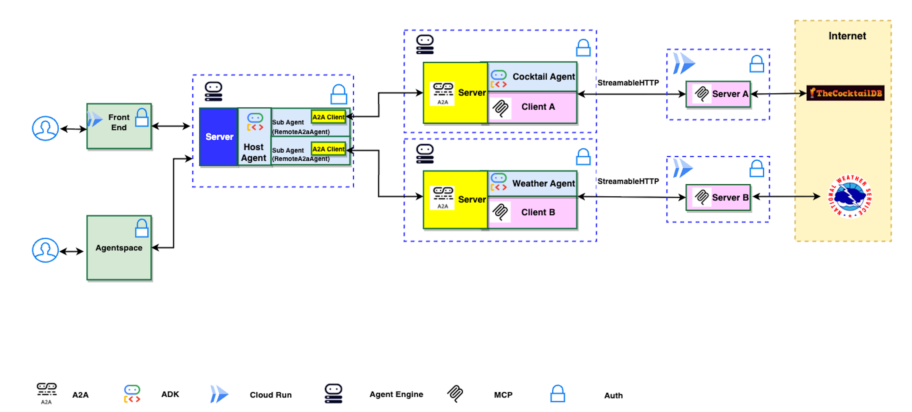

# A2A Multi-Agent on Agent Engine

> **DISCLAIMER**: THIS DEMO IS INTENDED FOR DEMONSTRATION PURPOSES ONLY. IT IS NOT INTENDED FOR USE IN A PRODUCTION ENVIRONMENT.
>
> **Important**: A2A is a work in progress (WIP) thus, in the near future there might be changes that are different from what demonstrated here.

> **Important**: Please run it in **Cloud Shell** to ensure you have the proper permissions.

This document describes a multi-agent set up using Agent2Agent (A2A), ADK, Agent Engine, MCP servers, and the ADK extension for A2A. It provides an overview of how the A2A protocol works between agents, and how the extension is activated on the server and included in the response.

## Overview

This application demonstrates the integration of Google's Open Source frameworks Agent2Agent (A2A) and Agent Development Kit (ADK) for multi-agent orchestration with Model Context Protocol (MCP) clients. The application features a host agent coordinating tasks between specialized remote A2A agents that interact with various MCP servers to fulfill user requests.

### Architecture

The application utilizes a multi-agent architecture where a host agent delegates tasks to remote A2A agents (Cocktail and Weather) based on the user's query. These agents then interact with corresponding remote MCP servers.

**Host Agent is built using Agent Engine server and ADK agents.**



### Application Screenshot


## Core Components

### Agents

The application employs three distinct agents:

- **Host Agent:** An ADK `LlmAgent` that receives user queries, determines the required task(s), and delegates to the appropriate specialized agent(s) via `RemoteA2aAgent` sub-agents.
- **Cocktail Agent:** Handles requests related to cocktail recipes and ingredients by interacting with the Cocktail MCP server.
- **Weather Agent:** Manages requests related to weather forecasts by interacting with the Weather MCP server.

### MCP Servers and Tools

The agents interact with the following MCP servers:

1. **Cocktail MCP Server** (Cloud Run)
    - Provides 5 tools:
        - `search cocktail by name`
        - `list all cocktail by first letter`
        - `search ingredient by name`
        - `list random cocktails`
        - `lookup full cocktail details by id`
2. **Weather MCP Server** (Cloud Run)
    - Provides 3 tools:
        - `get weather forecast by city name`
        - `get weather forecast by coordinates`
        - `get weather alert by state code`

## Project Structure

```
.
├── .cloudbuild/                  # Cloud Build CI/CD pipelines
│   ├── pr_checks.yaml            #   PR validation (unit + integration tests)
│   ├── staging.yaml              #   Staging deployment (on push to staging)
│   └── deploy-to-prod.yaml       #   Production deployment (manual approval)
├── asset/                        # Architecture diagrams, screenshots
├── deployment/
│   ├── deploy_agents.py          # Python script to deploy all agents
│   └── terraform/                # Terraform IaC for infrastructure
│       ├── apis.tf               #   GCP API enablement
│       ├── backend.tf            #   Terraform state backend (GCS)
│       ├── build_triggers.tf     #   Cloud Build triggers
│       ├── github.tf             #   GitHub connection + repository
│       ├── iam.tf                #   IAM role assignments
│       ├── locals.tf             #   Agent definitions, service lists
│       ├── providers.tf          #   Provider versions
│       ├── service.tf            #   Agent Engine resources
│       ├── service_accounts.tf   #   Service accounts (CICD + app)
│       ├── storage.tf            #   GCS buckets for logs
│       ├── telemetry.tf          #   BigQuery telemetry
│       └── variables.tf          #   Input variables
├── scripts/
│   ├── deploy_agent.py           # CLI tool to deploy individual agents
│   └── register_agent_to_agentspace.py  # Register agents to Agentspace
├── src/
│   ├── a2a_agents/               # Agent source code (workspace package)
│   │   ├── common/               #   Shared executors, auth utilities
│   │   ├── cocktail_agent/       #   Cocktail agent card, executor, ADK agent
│   │   ├── hosting_agent/        #   Host agent (LlmAgent + RemoteA2aAgent)
│   │   └── weather_agent/        #   Weather agent card, executor, ADK agent
│   ├── frontend/                 # Gradio frontend (connects via A2A)
│   │   ├── Dockerfile
│   │   ├── main.py
│   │   └── pyproject.toml
│   └── mcp_servers/              # MCP server implementations
│       ├── cocktail_mcp_server/
│       └── weather_mcp_server/
├── tests/
│   ├── conftest.py               # Adds src/ to sys.path
│   ├── unit/                     # Unit tests (agent cards, servers, logic)
│   ├── integration/              # Integration tests (local + remote agents)
│   ├── eval/                     # Evaluation suite (evalsets, config)
│   └── load_test/                # Locust load tests
├── pyproject.toml
├── uv.lock
├── Makefile
└── README.md
```

## Example Usage

Here are some example questions you can ask the chatbot:

- `Please get cocktail margarita id and then full detail of cocktail margarita`
- `Please list a random cocktail`
- `Please get weather forecast for New York`
- `What is the weather in Houston, TX?`

## Setup and Deployment

### Prerequisites

1. [Python 3.12+](https://www.python.org/downloads/)
2. [gcloud SDK](https://cloud.google.com/sdk/docs/install)
3. [Terraform](https://developer.hashicorp.com/terraform/install) (>= 1.0)
4. [uv](https://docs.astral.sh/uv/getting-started/installation/) (Python package manager)
5. A GitHub repository for your source code
6. Three Google Cloud projects:
   - **CI/CD project** — runs Cloud Build pipelines
   - **Staging project** — staging environment for agents and services
   - **Production project** — production environment

### Local Testing

#### 1. Install dependencies

```bash
uv sync
```

#### 2. Configure environment

Create `src/a2a_agents/.env` with:

```bash
GOOGLE_GENAI_USE_VERTEXAI=True
GOOGLE_CLOUD_PROJECT="your-project-id"
GOOGLE_CLOUD_LOCATION="us-central1"
PROJECT_ID="your-project-id"
PROJECT_NUMBER="your-project-number"
CT_AGENT_URL="https://..."   # Deployed cocktail agent A2A URL
WEA_AGENT_URL="https://..."  # Deployed weather agent A2A URL
CT_MCP_SERVER_URL="https://..."
WEA_MCP_SERVER_URL="https://..."
```

#### 3. Run hosting agent locally

```bash
python tests/integration/test_hosting_agent_local.py
```

#### 4. Run the frontend locally

Create `src/frontend/.env` with:

```bash
PROJECT_ID="your-project-id"
PROJECT_NUMBER="your-project-number"
AGENT_ENGINE_ID="your-hosting-agent-engine-id"
GOOGLE_CLOUD_LOCATION="us-central1"
```

```bash
cd src/frontend
uv run python main.py
# Open http://localhost:8080
```

---

## CI/CD Setup

The project uses **Terraform** for infrastructure provisioning and **Cloud Build** for CI/CD pipelines.

### Step 1: Create a GitHub PAT Secret

Create a GitHub Personal Access Token and store it in Secret Manager in your CI/CD project:

```bash
echo -n "YOUR_GITHUB_PAT" | gcloud secrets create github-pat \
  --project=YOUR_CICD_PROJECT_ID \
  --data-file=-
```

### Step 2: Configure Terraform Variables

Create a `terraform.tfvars` file in `deployment/terraform/`:

```hcl
# Project IDs
cicd_runner_project_id = "your-cicd-project-id"
staging_project_id     = "your-staging-project-id"
prod_project_id        = "your-prod-project-id"

# GitHub
repository_owner          = "your-github-org-or-username"
repository_name           = "a2a-multiagent-ge-cicd"
github_app_installation_id = "YOUR_GITHUB_APP_INSTALLATION_ID"
github_pat_secret_id       = "github-pat"

# Set to true on first run to create the Cloud Build GitHub connection
create_cb_connection = true

# Set to true only if you want Terraform to create the GitHub repo
create_repository = false

# Region
region = "us-central1"
```

### Step 3: Configure Terraform Backend

Update `deployment/terraform/backend.tf` with your GCS bucket for Terraform state:

```hcl
terraform {
  backend "gcs" {
    bucket = "your-project-terraform-state"
    prefix = "a2a-multiagent-ge-cicd"
  }
}
```

Create the state bucket if it doesn't exist:

```bash
gcloud storage buckets create gs://your-project-terraform-state \
  --project=YOUR_CICD_PROJECT_ID \
  --location=us-central1
```

### Step 4: Run Terraform

```bash
cd deployment/terraform

terraform init
terraform plan    # Review the changes
terraform apply   # Apply the changes
```

This provisions:

| Resource | Description |
|---|---|
| **Service Accounts** | `{project-name}-cb` (CI/CD runner), `{project-name}-app` (agent runner, per env) |
| **IAM Roles** | AI Platform, Storage, Logging, Cloud Build roles for each SA |
| **GCP APIs** | Vertex AI, Cloud Run, Cloud Build, BigQuery, etc. |
| **Cloud Build Triggers** | PR checks, staging CD, production deployment |
| **GitHub Connection** | Cloud Build ↔ GitHub repository link |
| **Agent Engine Resources** | 3 agents × 2 environments = 6 Reasoning Engine resources (initialized with dummy code) |
| **Storage Buckets** | Logs and feedback data buckets per project |
| **Telemetry** | BigQuery datasets + Cloud Logging sinks for observability |

### Step 5: Verify Cloud Build Triggers

After Terraform completes, verify the triggers were created:

```bash
gcloud builds triggers list \
  --project=YOUR_CICD_PROJECT_ID \
  --region=us-central1
```

You should see three triggers:

| Trigger | Branch | Pipeline |
|---|---|---|
| `pr-a2a-multiagent-ge-cicd` | PR → `main` | `.cloudbuild/pr_checks.yaml` |
| `cd-a2a-multiagent-ge-cicd` | Push → `staging` | `.cloudbuild/staging.yaml` |
| `deploy-a2a-multiagent-ge-cicd` | Manual (approval required) | `.cloudbuild/deploy-to-prod.yaml` |

---

## CI/CD Pipelines

### PR Checks (`.cloudbuild/pr_checks.yaml`)

Triggered on pull requests to `main`. Runs:

1. Install dependencies (`uv sync --locked`)
2. Unit tests (`pytest tests/unit`)
3. Integration tests (`pytest tests/integration`)

### Staging Deployment (`.cloudbuild/staging.yaml`)

Triggered on push to `staging` branch. Runs:

1. **Build & deploy MCP servers** to Cloud Run (`cocktail-mcp-ge-staging`, `weather-mcp-ge-staging`)
2. **Extract MCP URLs** from deployed Cloud Run services
3. **Install Python dependencies** (`uv sync`)
4. **Deploy agents** to Agent Engine via `deployment/deploy_agents.py`
   - Cocktail Agent GE2, Weather Agent GE2, Hosting Agent GE2
5. **Build & deploy frontend** to Cloud Run (`a2a-frontend-ge2`)

### Production Deployment (`.cloudbuild/deploy-to-prod.yaml`)

Triggered manually with **approval required**. Same steps as staging but targeting the production project:

- MCP servers: `cocktail-mcp-ge-prod`, `weather-mcp-ge-prod`
- Frontend: `a2a-frontend-ge2-prod`
- Agents: `*Agent GE2 Prod`
- Registers the hosting agent to Gemini Enterprise Agentspace

### Naming Convention

| Component | Staging | Production |
|---|---|---|
| Cocktail MCP | `cocktail-mcp-ge-staging` | `cocktail-mcp-ge-prod` |
| Weather MCP | `weather-mcp-ge-staging` | `weather-mcp-ge-prod` |
| Frontend | `a2a-frontend-ge2` | `a2a-frontend-ge2-prod` |
| Cocktail Agent Engine | `Cocktail Agent GE2 Staging` | `Cocktail Agent GE2 Prod` |
| Weather Agent Engine | `Weather Agent GE2 Staging` | `Weather Agent GE2 Prod` |
| Hosting Agent Engine | `Hosting Agent GE2 Staging` | `Hosting Agent GE2 Prod` |

---

## Running Tests

```bash
# Unit tests
uv run pytest tests/unit/

# Integration tests (requires deployed agents)
uv run pytest tests/integration/ -m integration

# Hosting agent local test
python tests/integration/test_hosting_agent_local.py

# Hosting agent remote test (requires deployed ADK agent)
python tests/integration/test_hosting_agent_remote_adk.py

# Evaluation
uv run python tests/eval/run_evaluation.py

# Load tests (requires locust)
cd tests/load_test
locust -f load_test_comprehensive.py
```

## Disclaimer

**Important**: The sample code provided is for demonstration purposes and illustrates the mechanics of the Agent-to-Agent (A2A) protocol. When building production applications, it is critical to treat any agent operating outside of your direct control as a potentially untrusted entity.

All data received from an external agent—including but not limited to its AgentCard, messages, artifacts, and task statuses—should be handled as untrusted input. For example, a malicious agent could provide an AgentCard containing crafted data in its fields (e.g., description, name, skills.description). If this data is used without sanitization to construct prompts for a Large Language Model (LLM), it could expose your application to prompt injection attacks. Failure to properly validate and sanitize this data before use can introduce security vulnerabilities into your application.

Developers are responsible for implementing appropriate security measures, such as input validation and secure handling of credentials to protect their systems and users.

## License

This project is licensed under the [MIT License](LICENSE).
