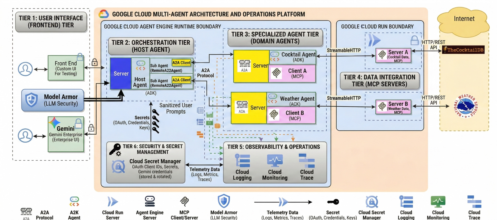
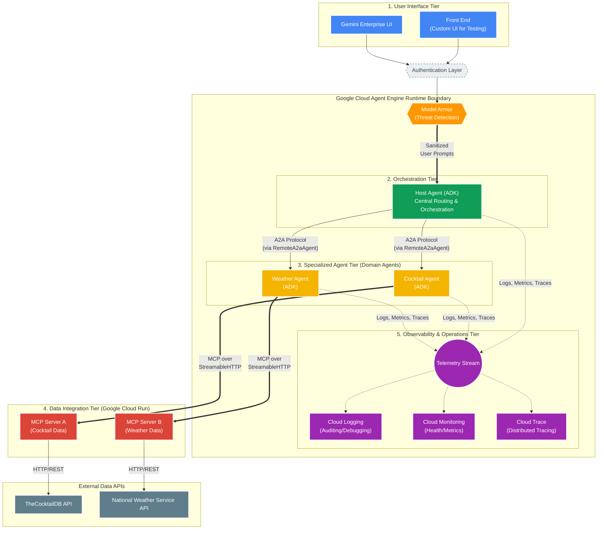
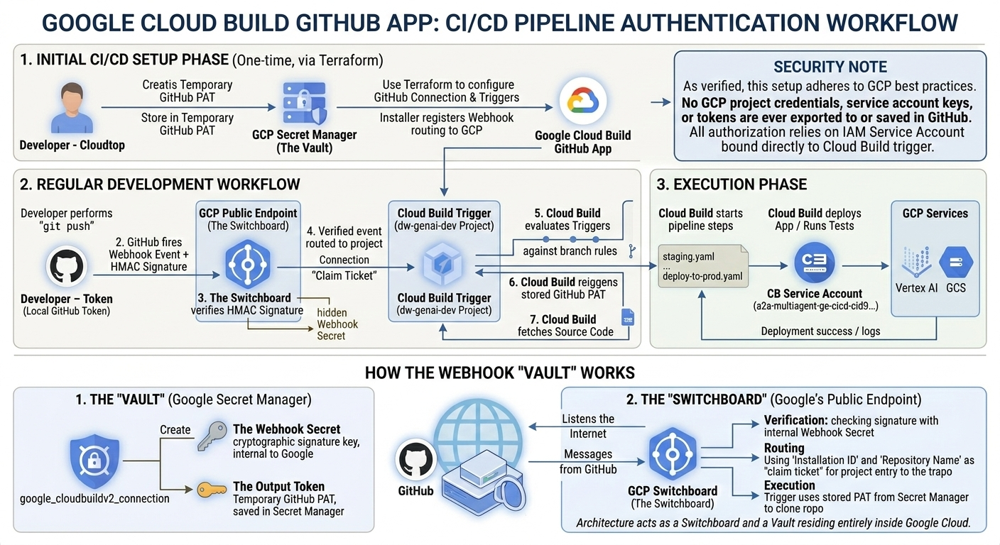

# Gemini Enterprise with A2A Multi-Agent on Agent Engine


This document describes a multi-agent set up using Agent2Agent (A2A), ADK, Agent Engine, MCP servers, and the ADK extension for A2A. It provides an overview of how the A2A protocol works between agents, and how the extension is activated on the server and included in the response.

## Table of Contents

- [Overview](#overview)
  - [Architecture](#architecture)
  - [Application Screenshot](#application-screenshot)
- [Core Components](#core-components)
  - [Agents](#agents)
  - [MCP Servers and Tools](#mcp-servers-and-tools)
- [Project Structure](#project-structure)
- [Example Usage](#example-usage)
- [Quick Start](#quick-start)
  - [Prerequisites](#prerequisites)
- [CI/CD Setup with Google Cloud Build V2](#cicd-setup-with-google-cloud-build-v2)
  - [Option 1: Quick Setup with agent-starter-pack (Recommended)](#option-1-quick-setup-with-agent-starter-pack-recommended)
  - [Option 2: Manual Setup with Terraform](#option-2-manual-setup-with-terraform)
    - [Step 1: Create GitHub Personal Access Token (PAT)](#step-1-create-github-personal-access-token-pat)
    - [Step 2: Configure Terraform Variables](#step-2-configure-terraform-variables)
    - [Step 3: Configure Terraform Backend](#step-3-configure-terraform-backend)
    - [Step 4: Initialize and Apply Terraform](#step-4-initialize-and-apply-terraform)
    - [Step 5: Authorize GitHub Connection](#step-5-authorize-github-connection)
    - [Step 6: Verify Setup](#step-6-verify-setup)
- [CI/CD Pipeline Details](#cicd-pipeline-details)
  - [How Environment Variables Flow Through CI/CD](#how-environment-variables-flow-through-cicd)
  - [PR Checks Pipeline (`.cloudbuild/pr_checks.yaml`)](#pr-checks-pipeline-cloudbuildpr_checksyaml)
  - [Staging Deployment Pipeline (`.cloudbuild/staging.yaml`)](#staging-deployment-pipeline-cloudbuildstagingyaml)
  - [Production Deployment Pipeline (`.cloudbuild/deploy-to-prod.yaml`)](#production-deployment-pipeline-cloudbuilddeploy-to-prodyaml)
  - [Important: MCP URL Trailing Slash](#important-mcp-url-trailing-slash)
- [Local Development & Testing Setup](#local-development--testing-setup)
  - [Understanding Environment Variables](#understanding-environment-variables)
  - [Step 1: Get Your GCP Information](#step-1-get-your-gcp-information)
  - [Step 2: Configure Local Environment Variables](#step-2-configure-local-environment-variables)
    - [Option A: Copy Example Files](#option-a-copy-example-files)
    - [Option B: Create from Scratch](#option-b-create-from-scratch)
  - [Step 3: Install Dependencies](#step-3-install-dependencies)
  - [Step 4: Test Configuration](#step-4-test-configuration)
  - [Testing Individual Components](#testing-individual-components)
    - [1. Test MCP Servers Locally](#1-test-mcp-servers-locally)
    - [2. Test Agents Locally](#2-test-agents-locally)
    - [3. Test Frontend Locally](#3-test-frontend-locally)
  - [Running All Tests](#running-all-tests)
  - [LLM-based Evaluation Scoring (Flex PayGo)](#llm-based-evaluation-scoring-flex-paygo)
    - [Verification Status](#verification-status)
    - [How to Run](#how-to-run)
- [Deployment](#deployment)
  - [Deploy to Staging](#deploy-to-staging)
  - [Deploy to Production](#deploy-to-production)
  - [Securing the Frontend](#securing-the-frontend)
- [Troubleshooting](#troubleshooting)
  - [Common Issues](#common-issues)
    - [1. MCP Connection Failures](#1-mcp-connection-failures)
    - [2. Frontend Can't Connect to Agent](#2-frontend-cant-connect-to-agent)
    - [3. Cloud Build Trigger Not Working](#3-cloud-build-trigger-not-working)
    - [4. Permission Errors](#4-permission-errors)
  - [Debugging Tips](#debugging-tips)
- [Resource Naming Conventions](#resource-naming-conventions)
- [Additional Resources](#additional-resources)
- [Security Best Practices](#security-best-practices)
- [Disclaimer](#disclaimer)
- [License](#license)

## Overview

This application demonstrates the integration of Google's Open Source frameworks Agent2Agent (A2A) and Agent Development Kit (ADK) for multi-agent orchestration with Model Context Protocol (MCP) clients. The application features a host agent coordinating tasks between specialized remote A2A agents that interact with various MCP servers to fulfill user requests.

### Architecture



The application utilizes a multi-agent architecture where a host agent delegates tasks to remote A2A agents (Cocktail and Weather) based on the user's query. These agents then interact with corresponding remote MCP servers.

**Host Agent is built using Agent Engine server and ADK agents.**
This architecture follows a highly modular, delegated multi-agent pattern, utilizing Agent2Agent (A2A) protocols and Model Context Protocol (MCP) for routing and data retrieval, backed by comprehensive Google Cloud observability tools within the Agent Engine runtime.

1. User Interface (Frontend) Tier
Users interact with the system through two primary authenticated entry points. Both sit behind an authentication layer to ensure secure access to the backend.

Front End (Custom UI For Tesging purpose): A bespoke web or mobile application built for end-user interaction.

Gemini Enterprise UI: An enterprise-grade interface for interacting with the AI system.

2. Orchestration Tier (Host Agent)
This is the central routing and orchestration hub, hosted within the Google Cloud Agent Engine.

Core Framework: Built using the ADK (Agent Development Kit).

Functionality: The Host Agent receives authenticated user prompts. It acts as an intelligent router, analyzing the request to determine if it pertains to cocktails or weather.

Sub-Agent Delegation: It utilizes two internal RemoteA2aAgent components. These act as A2A Clients, securely delegating tasks via the A2A Protocol to the specialized remote agents.

3. Specialized Agent Tier (Domain Agents)
Two independent, domain-specific agents handle task execution. Both are hosted alongside the Host Agent within the Google Cloud Agent Engine.

Cocktail Agent (ADK): Receives cocktail-related instructions via A2A. It uses an MCP Client to request necessary data over StreamableHTTP.

Weather Agent (ADK): Receives weather-related instructions via A2A. It uses an MCP Client to request necessary data over StreamableHTTP.

4. Data Integration Tier (MCP Servers)
This tier securely fetches real-world data from external APIs using the Model Context Protocol (MCP). These servers are hosted on serverless Google Cloud Run infrastructure.

MCP Server A (Cocktail Data): Receives MCP requests and queries TheCocktailDB API via HTTP/REST to fetch drink recipes and ingredients.

MCP Server B (Weather Data): Receives MCP requests and queries the National Weather Service API via HTTP/REST to fetch forecasts and meteorological data.

5. Observability & Operations Tier
Integrated directly within the Google Cloud Agent Engine boundary, this tier provides comprehensive insight into the health, performance, and behavior of the multi-agent system. The Host Agent, Cocktail Agent, and Weather Agent all actively send Telemetry Data (Logs, Metrics, Traces) to these services:

Cloud Logging: Captures detailed logs from all agents for debugging, auditing, and analyzing agent thought processes and errors.

Cloud Monitoring: Collects performance metrics (e.g., latency, request counts, error rates, resource utilization) to monitor overall system health and define alerting policies.

Cloud Trace: Provides distributed tracing capabilities, following a user request’s journey from the Host Agent, through A2A delegation to sub-agents, and out to MCP calls. This is crucial for identifying latency bottlenecks in the multi-hop architecture.

6. Security, Resilience & Secret Management Tier
Sensitive credentials, such as OAuth Client IDs and Secrets required for Gemini Enterprise integration, are securely stored and managed using Google Cloud Secret Manager. This ensures that no secrets are hardcoded in the application source code or repository.
Model Armor is integrated at the infrastructure level to automatically inspect and block threats in LLM prompts and responses, protecting against prompt injection and data exfiltration.
An HTTP Circuit Breaker (using `aiobreaker`) is implemented within the agent execution flow to prevent catastrophic cascading failures when external services or MCP servers are unavailable.

Summary of Key Technologies Used
Hosting & Runtime: Google Cloud Agent Engine, Google Cloud Run.

Agent Frameworks & Protocols: ADK (Agent Development Kit), A2A (Agent2Agent Protocol), MCP (Model Context Protocol), StreamableHTTP.

Observability: Google Cloud Trace, Google Cloud Monitoring, Google Cloud Logging.

Security, Resilience & State: Google Cloud Secret Manager, Model Armor (LLM Security), aiobreaker (HTTP Circuit Breaker), Vertex AI Session Service, Gemini Resource Retries.

External Data: TheCocktailDB API, National Weather Service API.


Here is the mermaid diagram of the workflow:



### Application Screenshot


## Core Components

### Agents

The application employs three distinct agents:

- **Host Agent:** An ADK `LlmAgent` that receives user queries, determines the required task(s), and delegates to the appropriate specialized agent(s) via `RemoteA2aAgent` sub-agents.
- **Cocktail Agent:** Handles requests related to cocktail recipes and ingredients by interacting with the Cocktail MCP server.
- **Weather Agent:** Manages requests related to weather forecasts by interacting with the Weather MCP server.

### MCP Servers and Tools

The agents interact with the following MCP servers:

1. **Cocktail MCP Server** (Cloud Run)
    - Provides 5 tools:
        - `search cocktail by name`
        - `list all cocktail by first letter`
        - `search ingredient by name`
        - `list random cocktails`
        - `lookup full cocktail details by id`
2. **Weather MCP Server** (Cloud Run)
    - Provides 3 tools:
        - `get weather forecast by city name`
        - `get weather forecast by coordinates`
        - `get weather alert by state code`

## Project Structure

```
.
├── .cloudbuild/                  # Cloud Build CI/CD pipelines
│   ├── pr_checks.yaml            #   PR validation (unit + integration tests)
│   ├── staging.yaml              #   Staging deployment (on push to staging)
│   └── deploy-to-prod.yaml       #   Production deployment (manual approval)
├── assets/                       # Architecture diagrams, screenshots
├── deployment/
│   ├── deploy_agents.py          # Python script to deploy all agents
│   └── terraform/                # Terraform IaC for infrastructure
│       ├── apis.tf               #   GCP API enablement
│       ├── backend.tf            #   Terraform state backend (GCS)
│       ├── build_triggers.tf     #   Cloud Build triggers
│       ├── frontend.tf           #   Frontend Cloud Run service
│       ├── gemini_enterprise.tf  #   Registers Agent Engine to Gemini Enterprise
│       ├── github.tf             #   GitHub connection + repository
│       ├── iam.tf                #   IAM role assignments
│       ├── locals.tf             #   Agent definitions, service lists
│       ├── model_armor.tf        #   Model Armor configuration
│       ├── providers.tf          #   Provider versions
│       ├── service_accounts.tf   #   Service accounts (CICD + app)
│       ├── storage.tf            #   GCS buckets for logs
│       ├── telemetry.tf          #   BigQuery telemetry
│       ├── variables.tf          #   Input variables
│       ├── modules/              #   Reusable Terraform modules
│       │   ├── gemini_enterprise_oauth/
│       │   └── gemini_enterprise_agent_engine_register/
│       └── shells/               #   GE registration + MCP services
│           ├── gemini_enterprise_registration.tf
│           ├── mcp_servers.tf    #   MCP Cloud Run service definitions
│           └── mcp_iam.tf        #   MCP server IAM permissions
├── src/
│   ├── a2a_agents/               # Agent source code (workspace package)
│   │   ├── common/               #   Shared executors, auth utilities
│   │   ├── cocktail_agent/       #   Cocktail agent card, executor, ADK agent
│   │   ├── hosting_agent/        #   Host agent (LlmAgent + RemoteA2aAgent)
│   │   └── weather_agent/        #   Weather agent card, executor, ADK agent
│   ├── frontend/                 # Gradio frontend (connects via A2A)
│   │   ├── Dockerfile
│   │   ├── main.py
│   │   └── pyproject.toml
│   └── mcp_servers/              # MCP server implementations
│       ├── cocktail_mcp_server/
│       └── weather_mcp_server/
├── tests/
│   ├── test_config.py            # Shared test configuration
│   ├── test_utils.py             # Shared test utilities
│   ├── conftest.py               # Adds src/ to sys.path
│   ├── unit/                     # Unit tests (agent cards, servers, orchestrator logic)
│   ├── integration/              # Integration tests (local + remote agents, MCP servers)
│   ├── eval/                     # Evaluation suite (evalsets, LLM scoring)
│   └── load_test/                # Locust load tests
├── .env.example                  # Environment variable template
├── pyproject.toml
├── uv.lock
├── Makefile
└── README.md
```

## Example Usage

Here are some example questions you can ask the chatbot:

- `Please get cocktail margarita id and then full detail of cocktail margarita`
- `Please list a random cocktail`
- `Please get weather forecast for New York`
- `What is the weather in Houston, TX?`

---

## Quick Start

### Prerequisites

1. [Python 3.13+](https://www.python.org/downloads/)
2. [gcloud SDK](https://cloud.google.com/sdk/docs/install)
3. [Terraform](https://developer.hashicorp.com/terraform/install) (>= 1.0)
4. [uv](https://docs.astral.sh/uv/getting-started/installation/) (Python package manager)
5. [Docker](https://docs.docker.com/get-docker/) (for local testing and deployment)
6. A GitHub repository for your source code
7. Three Google Cloud projects:
   - **CI/CD project** — runs Cloud Build pipelines
   - **Staging project** — staging environment for agents and services
   - **Production project** — production environment
8. **Gemini Enterprise App**: You need to set up a Gemini Enterprise App and provide its App ID.
9. **OAuth Credentials**: Obtain OAuth credentials for Gemini Enterprise (Client ID and Client Secret) and save them in the Staging and Production projects' Secret Manager.

---

## CI/CD Setup with Google Cloud Build V2

You will need create a GitHub repository and push this repository to GitHub.

### Environment Onboarding Workflow

1. **Clone Repo**
   Standard git cloning to get the application code and the Terraform configurations locally so you can bootstrap the environment.

2. **Set up GitHub to GCP Account Connection**
   This is critical. Because this project relies on Google Cloud Build for its CI/CD pipeline, GCP needs authorization to read from your cloned GitHub repository. You set up this Cloud Build Connection so that Google Cloud knows to listen for commits on specific branches for this repo.

3. **Run `terraform init` and `apply`**
   This is your "one-off" infrastructure bootstrap for a new environment. When you run this against a completely empty GCP project, Terraform will:
   - Enable all necessary Google Cloud APIs (Vertex AI, Cloud Run, Secret Manager, etc.).
   - Create the rigid security boundaries, Service Accounts, and IAM roles.
   - Create the Artifact Registry where your Docker containers will live.
   - Create the Cloud Build Triggers that link your GCP project to your GitHub repo.
   - Provision the "Shells" for your Cloud Run MCP Servers (using a dummy hello-world container) and your Vertex AI Agent Engines (using the `source-b64.txt` dummy payload).

   After Step 3, your infrastructure exists, but it doesn't do anything yet because it's full of dummy placeholder code.

4. **Modify code, and push to repo to trigger CI/CD pipeline**
   Once you push your code to the appropriate branch (e.g., `main` or `staging`), the Cloud Build trigger (from Step 2 & 3) will execute the `deploy-to-prod.yaml` or `staging.yaml` pipeline.
   - **The pipeline takes over:** It builds the actual Docker images for your MCP servers and pushes them to the Artifact Registry.
   - **SDK Deployment:** It runs `deployment/deploy_agents.py`, which uses the Python SDK to overwrite those dummy Terraform shells. It patches the Cloud Run services with the newly built Docker images and uploads your actual Python tarballs into the Agent Engine resources.

You have two options for setting up CI/CD:

### Option 1: Quick Setup with agent-starter-pack (Recommended)

The easiest way to set up CI/CD is using the `agent-starter-pack` tool:

```bash
# Install agent-starter-pack
uvx agent-starter-pack setup-cicd

# Follow the interactive prompts to:
# 1. Connect GitHub repository to Cloud Build
# 2. Create necessary service accounts
# 3. Set up Cloud Build triggers
# 4. Configure permissions
```

This tool will:
- ✅ Create Cloud Build V2 GitHub connection
- ✅ Link your GitHub repository
- ✅ Set up service accounts with proper permissions
- ✅ Create Cloud Build triggers for PR checks, staging, and production
- ✅ Configure all necessary IAM roles

### Option 2: Manual Setup with Terraform

If you prefer manual control or need customization:

#### Step 1: Create GitHub Personal Access Token (PAT)

1. Go to GitHub → Settings → Developer settings → Personal access tokens → Tokens (classic)
2. Generate new token with scopes:
   - `repo` (Full control of private repositories)
   - `admin:repo_hook` (Full control of repository hooks)
3. Save the token securely

**Store PAT in Secret Manager:**

```bash
echo -n "YOUR_GITHUB_PAT" | gcloud secrets create github-pat \
  --project=YOUR_CICD_PROJECT_ID \
  --data-file=-
```

#### Step 2: Configure Terraform Variables

Create `deployment/terraform/terraform.tfvars`:

```bash
cd deployment/terraform
cp terraform.tfvars.example terraform.tfvars
```

Edit `terraform.tfvars`:

```hcl
# Required: Project Configuration
cicd_runner_project_id = "your-cicd-project-id"
staging_project_id     = "your-staging-project-id"
prod_project_id        = "your-prod-project-id"

# Required: Project Numbers (NOT IDs)
# Get with: gcloud projects describe PROJECT_ID --format="value(projectNumber)"
staging_project_number = "123456789012"
prod_project_number    = "234567890123"

# Required: GitHub Configuration
repository_owner = "your-github-username-or-org"
repository_name  = "a2a-multiagent-ge-cicd"

# Cloud Build GitHub Connection
# Set to true on FIRST RUN to create the connection
create_cb_connection = true
host_connection_name = "a2a-multiagent-ge-cicd-github-connection"

# GitHub PAT Secret (created above)
github_pat_secret_id = "github-pat"

# GitHub App Installation ID (optional - if using GitHub App instead of PAT)
# github_app_installation_id = "12345678"

# Set to true only if you want Terraform to create the GitHub repo
create_repository = false

# Region
region = "us-central1"

# Optional: Frontend Configuration (leave empty for CI/CD deployment)
frontend_image_staging     = ""
frontend_image_prod        = ""
hosting_agent_id_staging   = ""
hosting_agent_id_prod      = ""

# Optional: gemini_enterprise Registration (for production)
ge_app_staging   = ""
ge_app_prod      = ""
auth_id_staging  = ""
auth_id_prod     = ""
```

#### Step 3: Configure Terraform Backend

Create or update `deployment/terraform/backend.tf`:

```hcl
terraform {
  backend "gcs" {
    bucket = "your-cicd-project-terraform-state"
    prefix = "a2a-multiagent-ge-cicd"
  }
}
```

**Create the state bucket:**

```bash
gcloud storage buckets create gs://your-cicd-project-terraform-state \
  --project=YOUR_CICD_PROJECT_ID \
  --location=us-central1 \
  --uniform-bucket-level-access
```

#### Step 4: Initialize and Apply Terraform

```bash
cd deployment/terraform

# Initialize Terraform
terraform init

# Review the changes
terraform plan

# Apply the configuration
terraform apply
```

**What Terraform Creates:**

| Resource | Description |
|----------|-------------|
| **Service Accounts** | `a2a-multiagent-ge-cicd-cb` (CI/CD runner), `a2a-multiagent-ge-cicd-app` (agents, per environment) |
| **IAM Roles** | AI Platform, Storage, Logging, Cloud Build roles for service accounts |
| **GCP APIs** | Vertex AI, Cloud Run, Cloud Build, BigQuery, Secret Manager, etc. |
| **Cloud Build Connection** | GitHub OAuth2 connection for Cloud Build V2 |
| **GitHub Repository Link** | Links your repo to Cloud Build |
| **Cloud Build Triggers** | 3 triggers: PR checks, staging deployment, production deployment |
| **Storage Buckets** | Logs and feedback data buckets per project |
| **BigQuery** | Telemetry datasets with Cloud Logging sinks |
| **MCP IAM** | Permissions for agents to invoke MCP services |
| **Gemini Enterprise App** | Registers the Hosting Agent Engine to Gemini Enterprise |

#### Step 5: Authorize GitHub Connection

After Terraform creates the Cloud Build GitHub connection:

1. Go to Cloud Console → Cloud Build → Triggers
2. You'll see a prompt to authorize the GitHub connection
3. Click "Authorize" and complete the GitHub OAuth flow
4. Grant access to your repository

Alternatively, use the CLI:

```bash
# Get the connection name
gcloud builds connections list \
  --project=YOUR_CICD_PROJECT_ID \
  --region=us-central1

# Follow the authorization URL if needed
```

#### Step 6: Verify Setup

```bash
# Check Cloud Build triggers
gcloud builds triggers list \
  --project=YOUR_CICD_PROJECT_ID \
  --region=us-central1

# Check GitHub connection
gcloud builds connections describe a2a-multiagent-ge-cicd-github-connection \
  --project=YOUR_CICD_PROJECT_ID \
  --region=us-central1

# Check repository linkage
gcloud builds repositories list \
  --connection=a2a-multiagent-ge-cicd-github-connection \
  --project=YOUR_CICD_PROJECT_ID \
  --region=us-central1
```

You should see three triggers:

| Trigger | Event | Pipeline | Description |
|---------|-------|----------|-------------|
| `pr-a2a-multiagent-ge-cicd` | PR → `main` | `.cloudbuild/pr_checks.yaml` | Runs unit and integration tests |
| `cd-a2a-multiagent-ge-cicd` | Push → `staging` | `.cloudbuild/staging.yaml` | Deploys to staging environment |
| `deploy-a2a-multiagent-ge-cicd` | Manual trigger | `.cloudbuild/deploy-to-prod.yaml` | Deploys to production (requires approval) |

---

## CI/CD Pipeline Details

### How Environment Variables Flow Through CI/CD

```
terraform.tfvars (your configuration)
    ↓
Terraform Variables (variables.tf)
    ↓
Build Trigger Substitutions (build_triggers.tf)
    ↓
Cloud Build YAML (_SUBSTITUTION_VARS)
    ↓
Runtime Environment Variables (export)
    ↓
Deployment Scripts (deploy_agents.py)
    ↓
Deployed Resources
```

**Example Flow:**

1. You set `staging_project_id = "my-staging"` in `terraform.tfvars`
2. Terraform sets `_STAGING_PROJECT_ID = var.staging_project_id` in build trigger
3. Cloud Build YAML uses `${_STAGING_PROJECT_ID}`
4. Deployment script gets `PROJECT_ID=my-staging` as environment variable
5. Agents deploy to `my-staging` project

### PR Checks Pipeline (`.cloudbuild/pr_checks.yaml`)

**Triggered:** When opening/updating a PR to `main` branch

**Steps:**
1. Install dependencies (`uv sync --locked`)
2. Run unit tests (`pytest tests/unit`)
3. Run integration tests (`pytest tests/integration`)

**Configuration:** No substitutions needed (reads from repo)

### Staging Deployment Pipeline (`.cloudbuild/staging.yaml`)

**Triggered:** When pushing to `staging` branch

**Steps:**
1. **Build & Deploy MCP Servers**
   - Builds Docker images for Cocktail and Weather MCP servers
   - Deploys to Cloud Run: `cocktail-mcp-ge-staging`, `weather-mcp-ge-staging`
   - Uses staging service account

2. **Extract MCP URLs**
   - Queries Cloud Run to get service URLs
   - **Automatically appends `/mcp/` with trailing slash**
   - Saves URLs to workspace for agent deployment

3. **Install Dependencies**
   - Installs Python packages with `uv sync`

4. **Deploy Agents**
   - Exports environment variables from substitutions:
     ```bash
     export CT_MCP_SERVER_URL=$(cat /workspace/cocktail_url.txt)
     export WEA_MCP_SERVER_URL=$(cat /workspace/weather_url.txt)
     export PROJECT_ID="${_STAGING_PROJECT_ID}"
     export GOOGLE_CLOUD_REGION="${_REGION}"
     export APP_SERVICE_ACCOUNT="${_APP_SERVICE_ACCOUNT_STAGING}"
     export DISPLAY_NAME_SUFFIX="Staging"
     ```
   - Runs `deployment/deploy_agents.py` which deploys:
     - Cocktail Agent GE2 Staging
     - Weather Agent GE2 Staging
     - Hosting Agent GE2 Staging
   - Writes hosting agent ID to `/workspace/hosting_agent_id.txt`

5. **Build & Deploy Frontend**
   - Builds Docker image for Gradio frontend
   - Reads hosting agent ID from workspace
   - Deploys to Cloud Run: `a2a-frontend-ge2`
   - Sets environment variables with agent ID

**Substitutions (from Terraform):**
- `_STAGING_PROJECT_ID` → Staging project ID
- `_PROJECT_NUMBER` → Staging project number
- `_REGION` → Deployment region
- `_APP_SERVICE_ACCOUNT_STAGING` → Staging service account email

### Production Deployment Pipeline (`.cloudbuild/deploy-to-prod.yaml`)

**Triggered:** Manually (requires approval)

**Steps:** Same as staging but:
- Uses production project and service account
- Deploys to: `cocktail-mcp-ge-prod`, `weather-mcp-ge-prod`, `a2a-frontend-ge2-prod`
- Adds `DISPLAY_NAME_SUFFIX="Prod"` to agents
- Optionally registers hosting agent to gemini_enterprise (if `_ge_app` and `_AUTH_ID` configured)

**Substitutions (from Terraform):**
- `_PROD_PROJECT_ID` → Production project ID
- `_PROJECT_NUMBER` → Production project number
- `_REGION` → Deployment region
- `_APP_SERVICE_ACCOUNT_PROD` → Production service account email
- `_ge_app` → gemini_enterprise App ID (optional)
- `_AUTH_ID` → OAuth Client ID (optional)

### Important: MCP URL Trailing Slash

Both pipelines automatically append `/mcp/` with trailing slash to MCP URLs:

```bash
# In .cloudbuild/staging.yaml and deploy-to-prod.yaml
echo "$(gcloud run services describe cocktail-mcp-ge-staging --region ${_REGION} --format 'value(status.url)')/mcp/" > /workspace/cocktail_url.txt
```

**Why this matters:**
- FastMCP servers require `/mcp/` (with trailing slash)
- Without trailing slash → 307 Redirect → MCP session creation fails
- With trailing slash → Direct connection → MCP tools work ✅

---

## Local Development & Testing Setup

### Understanding Environment Variables

This project uses environment variables in multiple locations:

1. **Local Testing**: `src/a2a_agents/.env` and `src/frontend/.env`
2. **Deployment**: `.env.deploy` (for manual deployments)
3. **CI/CD**: Terraform variables → Cloud Build substitutions
4. **Tests**: `tests/test_config.py` (loads from `.env.deploy`)

### Step 1: Get Your GCP Information

Before configuring, gather this information:

```bash
# Get your project IDs
gcloud projects list

# Get project numbers (needed for agents)
gcloud projects describe YOUR_STAGING_PROJECT_ID --format="value(projectNumber)"
gcloud projects describe YOUR_PROD_PROJECT_ID --format="value(projectNumber)"

# Note your region (typically us-central1)
REGION="us-central1"
```

### Step 2: Configure Local Environment Variables

#### Option A: Copy Example Files

```bash
# Copy environment templates
cp .env.example .env.deploy
cp src/a2a_agents/.env.example src/a2a_agents/.env
cp src/frontend/.env.example src/frontend/.env
```

#### Option B: Create from Scratch

**Create `.env.deploy`:**

```bash
# Deployment environment variables
PROJECT_ID=your-staging-project-id
GOOGLE_CLOUD_REGION=us-central1
APP_SERVICE_ACCOUNT=a2a-multiagent-ge-cicd-app@your-staging-project-id.iam.gserviceaccount.com
DISPLAY_NAME_SUFFIX=Staging
BUCKET_NAME=your-staging-project-id-bucket

# MCP Server URLs (will be set after MCP servers are deployed)
# IMPORTANT: Include /mcp/ with trailing slash
CT_MCP_SERVER_URL=https://your-cocktail-mcp-url/mcp/
WEA_MCP_SERVER_URL=https://your-weather-mcp-url/mcp/
```

**Create `src/a2a_agents/.env`:**

```bash
# Vertex AI Configuration
GOOGLE_GENAI_USE_VERTEXAI=True
GOOGLE_CLOUD_PROJECT=your-staging-project-id
GOOGLE_CLOUD_LOCATION=us-central1

# Project Configuration
PROJECT_ID=your-staging-project-id
PROJECT_NUMBER=your-project-number

# MCP Server URLs (after deployment)
# IMPORTANT: Include /mcp/ with trailing slash
CT_MCP_SERVER_URL=https://your-cocktail-mcp-url/mcp/
WEA_MCP_SERVER_URL=https://your-weather-mcp-url/mcp/

# Agent URLs (after agent deployment)
CT_AGENT_URL=https://us-central1-aiplatform.googleapis.com/v1beta1/projects/PROJECT_NUMBER/locations/us-central1/reasoningEngines/COCKTAIL_AGENT_ID/a2a
WEA_AGENT_URL=https://us-central1-aiplatform.googleapis.com/v1beta1/projects/PROJECT_NUMBER/locations/us-central1/reasoningEngines/WEATHER_AGENT_ID/a2a
```

**Create `src/frontend/.env`:**

```bash
# Frontend Configuration
PROJECT_ID=your-staging-project-id
PROJECT_NUMBER=your-project-number
GOOGLE_CLOUD_LOCATION=us-central1

# Hosting Agent ID (after agent deployment)
AGENT_ENGINE_ID=your-hosting-agent-id
```

### Step 3: Install Dependencies

```bash
# Install uv (if not already installed)
curl -LsSf https://astral.sh/uv/install.sh | sh

# Install project dependencies
uv sync
```

### Step 4: Test Configuration

```bash
# Test that configuration loads correctly
cd tests
python -c "from test_config import *; print(f'PROJECT_ID: {PROJECT_ID}'); print(f'LOCATION: {LOCATION}')"
```


### Testing Individual Components

#### 1. Test MCP Servers Locally

```bash
# Test Cocktail MCP Server
cd src/mcp_servers/cocktail_mcp_server
uv run python cocktail_server.py
# Uses stdio transport

# Test Weather MCP Server
cd src/mcp_servers/weather_mcp_server
uv run python weather_server.py
# Uses stdio transport
```

#### 2. Test Agents Locally

**Prerequisites:**
- Agents must be deployed (to get agent IDs and URLs)
- MCP servers must be deployed (to get MCP URLs)

**Set up `src/a2a_agents/.env`:**

```bash
PROJECT_ID=your-staging-project-id
PROJECT_NUMBER=your-project-number
GOOGLE_CLOUD_LOCATION=us-central1

# Get these after deploying agents
CT_AGENT_URL=https://us-central1-aiplatform.googleapis.com/v1beta1/projects/PROJECT_NUMBER/locations/us-central1/reasoningEngines/COCKTAIL_AGENT_ID/a2a
WEA_AGENT_URL=https://us-central1-aiplatform.googleapis.com/v1beta1/projects/PROJECT_NUMBER/locations/us-central1/reasoningEngines/WEATHER_AGENT_ID/a2a

# MCP URLs (with trailing slash!)
CT_MCP_SERVER_URL=https://your-cocktail-mcp-url/mcp/
WEA_MCP_SERVER_URL=https://your-weather-mcp-url/mcp/
```

**Run local tests:**

```bash
# Test hosting agent locally
python tests/integration/test_hosting_agent_local.py

# Test deployed agents remotely
python tests/integration/test_deployed_agents.py

# Test deployed hosting agent
python tests/integration/test_hosting_agent.py
```

#### 3. Test Frontend Locally

**Set up `src/frontend/.env`:**

```bash
PROJECT_ID=your-staging-project-id
PROJECT_NUMBER=your-project-number
AGENT_ENGINE_ID=your-hosting-agent-id
GOOGLE_CLOUD_LOCATION=us-central1
```

**Run frontend:**

```bash
cd src/frontend
uv run python main.py
# Open http://localhost:8080
```

Test with queries:
- "weather in Houston, TX"
- "what's in a margarita?"
- "list a random cocktail"

### Running All Tests

```bash
# From project root
cd tests

# Run all tests using pytest
pytest

# Or run specific test suites
python integration/test_deployed_agents.py
python integration/test_hosting_agent.py
python integration/test_deployed_frontend.py

# Run with pytest
pytest tests/unit/
pytest tests/integration/
```

### LLM-based Evaluation Scoring (Flex PayGo)

The evaluation suite supports automated scoring using LLMs with **Flex PayGo (Flex Tier)** for cost-optimized evaluations.

#### Verification Status
Using the `gemini-3-flash-preview` model on the **global** endpoint, the system successfully scored all 12 evaluation examples through the Flex PayGo tier. Each request returned a `200 OK` from the Vertex AI API.

**Summary of Verification Run:**
- **Model**: `gemini-3-flash-preview`
- **Location**: `global`
- **GCP Project**: `dw-genai-dev` (example)
- **Flex Tier**: Verified (headers correctly processed and accepted)

#### How to Run
To run the evaluation with LLM scoring:
```bash
uv run python tests/eval/run_evaluation.py --evalset basic --use-llm --project [YOUR_PROJECT_ID]
```

Note: Flex PayGo requires specific headers and is primarily supported in the `global` region with preview models like `gemini-3-flash-preview`.

---

## Deployment

### Deploy to Staging

1. **Push to staging branch:**

   ```bash
   git checkout staging
   git merge main
   git push origin staging
   ```

2. **Monitor deployment:**

   ```bash
   # Watch build progress
   gcloud builds list --project=YOUR_CICD_PROJECT_ID --ongoing

   # View specific build logs
   gcloud builds log BUILD_ID --project=YOUR_CICD_PROJECT_ID
   ```

3. **Verify deployment:**

   After deployment completes:

   ```bash
   # Check MCP servers
   gcloud run services list --project=YOUR_STAGING_PROJECT_ID --region=us-central1

   # Check agents
   gcloud ai reasoning-engines list --project=YOUR_STAGING_PROJECT_ID --region=us-central1

   # Get frontend URL
   gcloud run services describe a2a-frontend-ge2 \
     --project=YOUR_STAGING_PROJECT_ID \
     --region=us-central1 \
     --format="value(status.url)"
   ```

4. **Test frontend:**

   Open the frontend URL and test queries.

### Deploy to Production

1. **Trigger production deployment:**

   ```bash
   gcloud builds triggers run deploy-a2a-multiagent-ge-cicd \
     --project=YOUR_CICD_PROJECT_ID \
     --region=us-central1 \
     --branch=main
   ```

2. **Approve deployment:**

   The production pipeline requires manual approval:
   - Go to Cloud Console → Cloud Build → Builds
   - Find the running build
   - Click "Review" and "Approve"

3. **Monitor and verify:**

   Same steps as staging but check production project.

---

### Securing the Frontend

To restrict access to the frontend so only you can access it, you need to remove public access and grant invoker permissions to your Google account.

1. **Remove public access (Require Authentication):**
    ```bash
    gcloud run services remove-iam-policy-binding a2a-frontend-lg \
      --region=${GOOGLE_CLOUD_REGION} \
      --project=${PROJECT_ID} \
      --member="allUsers" \
      --role="roles/run.invoker"
    ```

2. **Grant access directly to your account:**
    ```bash
    gcloud run services add-iam-policy-binding a2a-frontend-lg \
      --region=${GOOGLE_CLOUD_REGION} \
      --project=${PROJECT_ID} \
      --member="user:YOUR_GOOGLE_EMAIL" \
      --role="roles/run.invoker"
    ```

**Note:** Once secured, standard browsing will result in a 403 Forbidden error. To access the secured frontend locally, use the Cloud Run proxy:

```bash
gcloud run services proxy a2a-frontend-lg \
  --region=${GOOGLE_CLOUD_REGION} \
  --project=${PROJECT_ID} \
  --port=8080
```

Then visit `http://localhost:8080` in your browser.

---

## Troubleshooting

### Common Issues

#### 1. MCP Connection Failures

**Symptom:** Agents fail with "Failed to create MCP session" or "307 Redirect" errors

**Solution:** Verify MCP URLs have trailing slash:

```bash
# Check MCP URLs in deployment
grep "MCP_SERVER_URL" .env.deploy
# Should show: https://...run.app/mcp/ (with trailing slash)
```

#### 2. Frontend Can't Connect to Agent

**Symptom:** Frontend shows "No response" or connection errors

**Solution:** Verify agent ID in frontend environment:

```bash
# Get hosting agent ID
gcloud ai reasoning-engines list \
  --project=YOUR_PROJECT_ID \
  --region=us-central1 \
  --filter="displayName:Hosting"

# Update src/frontend/.env with correct AGENT_ENGINE_ID
```

#### 3. Cloud Build Trigger Not Working

**Symptom:** Push to branch doesn't trigger build

**Solution:** Check trigger configuration:

```bash
# List triggers
gcloud builds triggers list --project=YOUR_CICD_PROJECT_ID --region=us-central1

# Describe specific trigger
gcloud builds triggers describe cd-a2a-multiagent-ge-cicd \
  --project=YOUR_CICD_PROJECT_ID \
  --region=us-central1

# Check GitHub connection
gcloud builds connections describe a2a-multiagent-ge-cicd-github-connection \
  --project=YOUR_CICD_PROJECT_ID \
  --region=us-central1
```

Verify:
- ✅ GitHub connection is authorized
- ✅ Repository is linked
- ✅ Trigger is enabled
- ✅ Branch name matches (e.g., `staging`)

#### 4. Permission Errors

**Symptom:** "Permission denied" or "Forbidden" errors

**Solution:** Check service account permissions:

```bash
# Check app service account
gcloud projects get-iam-policy YOUR_PROJECT_ID \
  --flatten="bindings[].members" \
  --filter="bindings.members:serviceAccount:a2a-multiagent-ge-cicd-app@*"

# Check CI/CD service account
gcloud projects get-iam-policy YOUR_CICD_PROJECT_ID \
  --flatten="bindings[].members" \
  --filter="bindings.members:serviceAccount:a2a-multiagent-ge-cicd-cb@*"
```

Re-apply Terraform if permissions are missing (make sure to include the required targets):

```bash
cd deployment/terraform
terraform apply \
  -target='google_project_iam_member.other_projects_roles' \
  -target='google_project_iam_member.github_runner_modelarmor_admin' \
  -target='google_project_iam_member.github_runner_serviceusage_consumer'
```

### Debugging Tips

**View Cloud Build logs:**

```bash
gcloud builds log BUILD_ID --project=YOUR_CICD_PROJECT_ID
```

**View agent logs:**

```bash
# Get agent resource name
gcloud ai reasoning-engines list \
  --project=YOUR_PROJECT_ID \
  --region=us-central1

# View logs
gcloud logging read "resource.type=aiplatform.googleapis.com/ReasoningEngine AND resource.labels.reasoning_engine_id=AGENT_ID" \
  --project=YOUR_PROJECT_ID \
  --limit=50
```

**View Cloud Run logs:**

```bash
gcloud logging read "resource.type=cloud_run_revision AND resource.labels.service_name=a2a-frontend-ge2" \
  --project=YOUR_PROJECT_ID \
  --limit=50
```

---

## Resource Naming Conventions

| Component | Staging | Production |
|-----------|---------|------------|
| **Cocktail MCP** | `cocktail-mcp-ge-staging` | `cocktail-mcp-ge-prod` |
| **Weather MCP** | `weather-mcp-ge-staging` | `weather-mcp-ge-prod` |
| **Frontend** | `a2a-frontend-ge2` | `a2a-frontend-ge2-prod` |
| **Cocktail Agent** | `Cocktail Agent GE2 Staging` | `Cocktail Agent GE2 Prod` |
| **Weather Agent** | `Weather Agent GE2 Staging` | `Weather Agent GE2 Prod` |
| **Hosting Agent** | `Hosting Agent GE2 Staging` | `Hosting Agent GE2 Prod` |

---

## Additional Resources

- **[docs/design.md](docs/design.md)** - Software Design Document (architecture, security, deployment)
- **[docs/cicd_strategy.md](docs/cicd_strategy.md)** - CI/CD pipeline architecture and tooling rationale
- **[tests/README.md](tests/README.md)** - Testing guide and test framework docs

---

## Security Best Practices

1. **Never commit secrets** - Use Secret Manager for sensitive data
2. **Use service accounts** - Don't use personal credentials in automation
3. **Principle of least privilege** - Grant minimal required permissions
4. **Validate external input** - Treat A2A responses as untrusted (see Disclaimer)
5. **Enable audit logging** - Monitor access to resources
6. **Use private GCS buckets** - Enable uniform bucket-level access
7. **Review IAM regularly** - Remove unused permissions

---

## Disclaimer

**Important**: The sample code provided is for demonstration purposes and illustrates the mechanics of the Agent-to-Agent (A2A) protocol. When building production applications, it is critical to treat any agent operating outside of your direct control as a potentially untrusted entity.

All data received from an external agent—including but not limited to its AgentCard, messages, artifacts, and task statuses—should be handled as untrusted input. For example, a malicious agent could provide an AgentCard containing crafted data in its fields (e.g., description, name, skills.description). If this data is used without sanitization to construct prompts for a Large Language Model (LLM), it could expose your application to prompt injection attacks. Failure to properly validate and sanitize this data before use can introduce security vulnerabilities into your application.

Developers are responsible for implementing appropriate security measures, such as input validation and secure handling of credentials to protect their systems and users.

---

## License

This project is licensed under the [Apache 2.0 License](LICENSE).

@2026
