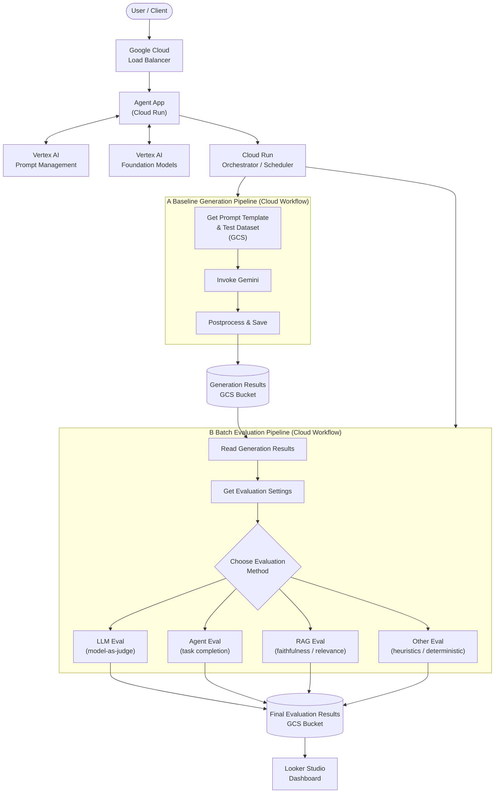

# Automated Generative AI Evaluation Pipeline

This document describes the Google Cloud Automated Generative AI Evaluation Pipeline. It moves from user interaction to automated performance measurement using a series of managed services, hosted in the `us-central1` region.

The system is structured around two primary automated flows: the **Baseline Generation Pipeline** and the **Batch Evaluation Pipeline**.

---

## Architecture Diagram

---

## Component Descriptions

### 1. User Interaction & Front-End

| Component | Description |
|---|---|
| **User / Client** | Entry point — a human or automated caller initiating a request. |
| **Google Cloud Load Balancer** | Manages incoming traffic and routes it to the Agent App. |
| **Agent App (Cloud Run)** | Core user-facing service running as a Cloud Run cluster. Integrates with Vertex AI Prompt Management for versioned prompt templates and Vertex AI foundation models for inference. |

### 2. Orchestration Layer

A central **Cloud Run Orchestrator** acts as the scheduler and event-driven trigger. It fans out into the two evaluation workflows below.

---

### A. Baseline Generation Pipeline

Implemented as a **Google Cloud Workflow**. Establishes a ground-truth or reference baseline for later evaluation.

1. **Get Prompt Template & Test Dataset** — Pulls versioned prompt templates and test inputs from GCS.
2. **Invoke Gemini** — Submits the assembled prompt to a Gemini foundation model and collects the response.
3. **Postprocess & Save** — Cleans and normalises the output, then writes it to the **Generation Results GCS Bucket**.

---

### B. Batch Evaluation Pipeline

Implemented as a second **Google Cloud Workflow**. Measures the quality of the generated output against multiple evaluation strategies.

1. **Read Generation Results** — Loads baseline outputs from the Generation Results GCS Bucket.
2. **Get Evaluation Settings** — Retrieves metric configuration and thresholds for the current evaluation run.
3. **Choose Evaluation Method** — Branches into one or more strategies:

| Strategy | Description |
|---|---|
| **LLM Eval** | Uses a separate LLM as an impartial judge to score the output. |
| **Agent Eval** | Tests how effectively an agent completed a multi-step task. |
| **RAG Eval** | Measures Retrieval-Augmented Generation quality — faithfulness and context relevance. |
| **Other Eval** | Custom heuristics or deterministic checks (e.g., format validation, latency thresholds). |

4. All strategy outputs are consolidated in the **Final Evaluation Results GCS Bucket**.

---

### 3. Results & Visualisation

| Component | Description |
|---|---|
| **Final Evaluation Results GCS Bucket** | Central store for all evaluation scores, metrics, and logs. |
| **Looker Studio** | Connects directly to the results bucket to surface a live dashboard for stakeholders, enabling trend tracking and regression detection over time. |
